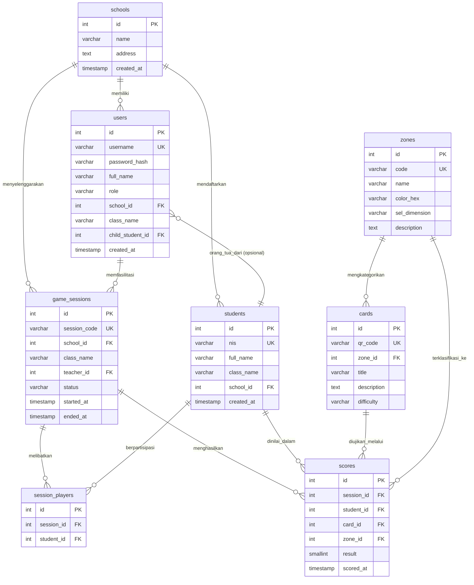
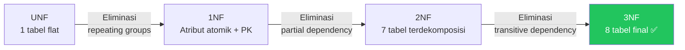

# DESAIN BASIS DATA
## Zonara Character Analytics (Enterprise Edition)
### Mengacu pada ISO/IEC 9075 (SQL Standard) & PostgreSQL 15

| Atribut | Keterangan |
|---------|-----------|
| **Nomor Dokumen** | ZCA-DBD-2026-001 |
| **Versi** | 1.0 |
| **Tanggal** | 24 Maret 2026 |
| **Klien** | Azhar M |
| **DBMS** | PostgreSQL 15 |
| **Dokumen Acuan** | ZCA-SRS-2026-001 (SRS), ZCA-UC-2026-001 (Use Case) |
| **Status** | Draft — Menunggu Persetujuan |

---

## Riwayat Revisi

| Versi | Tanggal | Penulis | Deskripsi Perubahan |
|-------|---------|---------|---------------------|
| 1.0 | 24/03/2026 | Azhar M | Draft awal desain basis data |

---

## Daftar Isi

1. [Entity-Relationship Diagram](#1-entity-relationship-diagram-erd)
2. [Kamus Data](#2-kamus-data-data-dictionary)
3. [Normalisasi](#3-normalisasi)
4. [Indeks & Optimasi](#4-indeks--optimasi)
5. [Schema SQL (DDL)](#5-schema-sql-ddl)

---

## 1. Entity-Relationship Diagram (ERD)

### 1.1 Identifikasi Entitas

Berdasarkan analisis SRS (Bab 3.0) dan Use Case Specification (UC-01 s/d UC-09), diperoleh **8 entitas utama** yang merepresentasikan domain bisnis sistem Zonara:

| No. | Entitas | Tipe | Deskripsi |
|-----|---------|------|-----------|
| 1 | `schools` | Master (Tenant) | Entitas organisasi tingkat atas; menjadi acuan *multi-tenant* untuk seluruh data |
| 2 | `users` | Master | Pengguna sistem dengan role RBAC (admin, guru_bk, wali_kelas, orang_tua) |
| 3 | `students` | Master | Siswa SD yang menjadi subjek penilaian karakter |
| 4 | `zones` | Referensi | Master dimensi karakter CASEL (4 zona: Biru, Hijau, Kuning, Merah) |
| 5 | `cards` | Referensi | Master kartu tantangan, masing-masing terhubung ke satu zona |
| 6 | `game_sessions` | Transaksional | Sesi permainan board game, dikelola oleh guru |
| 7 | `session_players` | Asosiatif (Junction) | Entitas penghubung relasi N:N antara `game_sessions` dan `students` |
| 8 | `scores` | Transaksional (Fakta) | Tabel fakta utama: rekaman hasil penilaian per siswa per kartu per sesi |

### 1.2 Diagram ER (Mermaid)



### 1.3 Deskripsi Relasi Tekstual

| No. | Relasi | Kardinalitas | Deskripsi | Partisipasi |
|-----|--------|:------------:|-----------|:-----------:|
| R-01 | `schools` → `users` | 1 : N | Satu sekolah memiliki banyak pengguna (guru, orang tua) | Parsial (user bisa belum terassign) |
| R-02 | `schools` → `students` | 1 : N | Satu sekolah mendaftarkan banyak siswa | Total (siswa wajib punya sekolah) |
| R-03 | `schools` → `game_sessions` | 1 : N | Satu sekolah menyelenggarakan banyak sesi permainan | Total |
| R-04 | `users` → `game_sessions` | 1 : N | Satu guru memfasilitasi banyak sesi | Total (sesi wajib punya guru) |
| R-05 | `users` → `students` | N : 1 | Satu user orang_tua terhubung ke satu siswa (child_student_id) | Parsial (hanya role orang_tua) |
| R-06 | `zones` → `cards` | 1 : N | Satu zona mengkategorikan banyak kartu (10 kartu per zona) | Total (kartu wajib punya zona) |
| R-07 | `game_sessions` ↔ `students` | N : N | Banyak siswa berpartisipasi dalam banyak sesi; dijembatani oleh `session_players` | — |
| R-08 | `game_sessions` → `scores` | 1 : N | Satu sesi menghasilkan banyak skor | Total |
| R-09 | `students` → `scores` | 1 : N | Satu siswa dinilai dalam banyak skor | Total |
| R-10 | `cards` → `scores` | 1 : N | Satu kartu diujikan dalam banyak skor | Total |
| R-11 | `zones` → `scores` | 1 : N | Satu zona muncul dalam banyak skor (*denormalisasi deliberat*) | Total |

> **Catatan R-11:** Kolom `zone_id` pada tabel `scores` merupakan **denormalisasi terkontrol** (*deliberate denormalization*). Secara normalisasi murni, `zone_id` dapat diturunkan dari `cards.zone_id`. Namun, penyalinan langsung ke `scores` dilakukan untuk **menghindari JOIN tambahan** pada query analitik Radar Chart yang berfrekuensi tinggi (lihat Bab 4: Indeks & Optimasi).

---

## 2. Kamus Data (*Data Dictionary*)

### 2.1 Tabel `schools` — Master Organisasi (Tenant)

| No. | Nama Field | Tipe Data | Panjang | Null | Default | PK/FK/UK | Keterangan |
|-----|-----------|-----------|:-------:|:----:|:-------:|:--------:|-----------|
| 1 | `id` | `SERIAL` | — | NO | auto_increment | **PK** | Identifikasi unik sekolah |
| 2 | `name` | `VARCHAR` | 255 | NO | — | — | Nama resmi sekolah (e.g., "SDN 1 Kebumen") |
| 3 | `address` | `TEXT` | — | YES | NULL | — | Alamat lengkap sekolah |
| 4 | `created_at` | `TIMESTAMP` | — | NO | `NOW()` | — | Waktu pencatatan entitas |

### 2.2 Tabel `users` — Pengguna Sistem (RBAC)

| No. | Nama Field | Tipe Data | Panjang | Null | Default | PK/FK/UK | Keterangan |
|-----|-----------|-----------|:-------:|:----:|:-------:|:--------:|-----------|
| 1 | `id` | `SERIAL` | — | NO | auto_increment | **PK** | Identifikasi unik pengguna |
| 2 | `username` | `VARCHAR` | 100 | NO | — | **UK** | Username login, harus unik secara global |
| 3 | `password_hash` | `VARCHAR` | 255 | NO | — | — | Hash password (bcrypt, salt round ≥ 12) |
| 4 | `full_name` | `VARCHAR` | 255 | NO | — | — | Nama lengkap pengguna |
| 5 | `role` | `VARCHAR` | 20 | NO | — | — | Peran: `admin`, `guru_bk`, `wali_kelas`, `orang_tua`. Dibatasi oleh CHECK constraint |
| 6 | `school_id` | `INTEGER` | — | YES | NULL | **FK** → `schools.id` | Referensi ke sekolah pengguna |
| 7 | `class_name` | `VARCHAR` | 50 | YES | NULL | — | Nama kelas (diisi jika role = wali_kelas) |
| 8 | `child_student_id` | `INTEGER` | — | YES | NULL | **FK** → `students.id` | ID siswa (diisi jika role = orang_tua) |
| 9 | `created_at` | `TIMESTAMP` | — | NO | `NOW()` | — | Waktu registrasi akun |

### 2.3 Tabel `students` — Siswa Sekolah Dasar

| No. | Nama Field | Tipe Data | Panjang | Null | Default | PK/FK/UK | Keterangan |
|-----|-----------|-----------|:-------:|:----:|:-------:|:--------:|-----------|
| 1 | `id` | `SERIAL` | — | NO | auto_increment | **PK** | Identifikasi unik siswa |
| 2 | `nis` | `VARCHAR` | 50 | YES | NULL | **UK** | Nomor Induk Siswa (opsional, unik jika diisi) |
| 3 | `full_name` | `VARCHAR` | 255 | NO | — | — | Nama lengkap siswa |
| 4 | `class_name` | `VARCHAR` | 50 | NO | — | — | Kelas aktif (e.g., "5A", "6B") |
| 5 | `school_id` | `INTEGER` | — | NO | — | **FK** → `schools.id` | Referensi ke sekolah |
| 6 | `created_at` | `TIMESTAMP` | — | NO | `NOW()` | — | Waktu pendaftaran siswa |

### 2.4 Tabel `zones` — Dimensi Karakter CASEL

| No. | Nama Field | Tipe Data | Panjang | Null | Default | PK/FK/UK | Keterangan |
|-----|-----------|-----------|:-------:|:----:|:-------:|:--------:|-----------|
| 1 | `id` | `SERIAL` | — | NO | auto_increment | **PK** | Identifikasi unik zona |
| 2 | `code` | `VARCHAR` | 20 | NO | — | **UK** | Kode zona: `blue`, `green`, `yellow`, `red` |
| 3 | `name` | `VARCHAR` | 100 | NO | — | — | Nama dimensi SEL (e.g., "Self-Awareness") |
| 4 | `color_hex` | `VARCHAR` | 7 | NO | — | — | Kode warna hex (e.g., "#3B82F6") |
| 5 | `sel_dimension` | `VARCHAR` | 100 | NO | — | — | Pemetaan ke kompetensi CASEL |
| 6 | `description` | `TEXT` | — | YES | NULL | — | Deskripsi lengkap dimensi |

### 2.5 Tabel `cards` — Kartu Tantangan Permainan

| No. | Nama Field | Tipe Data | Panjang | Null | Default | PK/FK/UK | Keterangan |
|-----|-----------|-----------|:-------:|:----:|:-------:|:--------:|-----------|
| 1 | `id` | `SERIAL` | — | NO | auto_increment | **PK** | Identifikasi unik kartu |
| 2 | `qr_code` | `VARCHAR` | 100 | NO | — | **UK** | String QR unik untuk pemindaian (e.g., "ZCA-B-001") |
| 3 | `zone_id` | `INTEGER` | — | NO | — | **FK** → `zones.id` | Zona yang mengkategorikan kartu |
| 4 | `title` | `VARCHAR` | 255 | NO | — | — | Judul misi kartu |
| 5 | `description` | `TEXT` | — | NO | — | — | Deskripsi lengkap misi yang harus dilakukan siswa |
| 6 | `difficulty` | `VARCHAR` | 20 | NO | `'normal'` | — | Tingkat kesulitan: `easy`, `normal`, `hard`. CHECK constraint |

### 2.6 Tabel `game_sessions` — Sesi Permainan

| No. | Nama Field | Tipe Data | Panjang | Null | Default | PK/FK/UK | Keterangan |
|-----|-----------|-----------|:-------:|:----:|:-------:|:--------:|-----------|
| 1 | `id` | `SERIAL` | — | NO | auto_increment | **PK** | Identifikasi unik sesi |
| 2 | `session_code` | `VARCHAR` | 10 | NO | — | **UK** | Kode sesi 6 karakter alfanumerik (generated) |
| 3 | `school_id` | `INTEGER` | — | NO | — | **FK** → `schools.id` | Sekolah tempat sesi berlangsung |
| 4 | `class_name` | `VARCHAR` | 50 | NO | — | — | Kelas yang bermain |
| 5 | `teacher_id` | `INTEGER` | — | NO | — | **FK** → `users.id` | Guru yang memfasilitasi sesi |
| 6 | `status` | `VARCHAR` | 20 | NO | `'active'` | — | Status sesi: `active`, `completed`. CHECK constraint |
| 7 | `started_at` | `TIMESTAMP` | — | NO | `NOW()` | — | Waktu mulai sesi |
| 8 | `ended_at` | `TIMESTAMP` | — | YES | NULL | — | Waktu selesai (diisi saat status → completed) |

### 2.7 Tabel `session_players` — Pemain dalam Sesi (Junction Table)

| No. | Nama Field | Tipe Data | Panjang | Null | Default | PK/FK/UK | Keterangan |
|-----|-----------|-----------|:-------:|:----:|:-------:|:--------:|-----------|
| 1 | `id` | `SERIAL` | — | NO | auto_increment | **PK** | Identifikasi unik record |
| 2 | `session_id` | `INTEGER` | — | NO | — | **FK** → `game_sessions.id` | Referensi sesi |
| 3 | `student_id` | `INTEGER` | — | NO | — | **FK** → `students.id` | Referensi siswa pemain |
| — | (`session_id`, `student_id`) | — | — | — | — | **UK** (Composite) | Menjamin satu siswa hanya terdaftar sekali per sesi |

### 2.8 Tabel `scores` — Tabel Fakta Penilaian

| No. | Nama Field | Tipe Data | Panjang | Null | Default | PK/FK/UK | Keterangan |
|-----|-----------|-----------|:-------:|:----:|:-------:|:--------:|-----------|
| 1 | `id` | `SERIAL` | — | NO | auto_increment | **PK** | Identifikasi unik skor |
| 2 | `session_id` | `INTEGER` | — | NO | — | **FK** → `game_sessions.id` | Sesi di mana penilaian terjadi |
| 3 | `student_id` | `INTEGER` | — | NO | — | **FK** → `students.id` | Siswa yang dinilai |
| 4 | `card_id` | `INTEGER` | — | NO | — | **FK** → `cards.id` | Kartu yang diuji |
| 5 | `zone_id` | `INTEGER` | — | NO | — | **FK** → `zones.id` | Zona dimensi (denormalisasi deliberat dari `cards.zone_id`) |
| 6 | `result` | `SMALLINT` | — | NO | — | — | Hasil: `0` (Gagal) atau `1` (Berhasil). CHECK constraint |
| 7 | `scored_at` | `TIMESTAMP` | — | NO | `NOW()` | — | Waktu penilaian dicatat |

---

## 3. Normalisasi

Proses normalisasi dilakukan untuk menjamin **integritas data**, **eliminasi redundansi**, dan **konsistensi referensial** dalam skema basis data Zonara. Analisis berikut mengikuti tahapan normalisasi formal dari *Unnormalized Form* (UNF) hingga *Third Normal Form* (3NF).

### 3.1 Unnormalized Form (UNF)

Pada kondisi awal, seluruh data penilaian karakter dapat direpresentasikan dalam satu tabel tunggal (*flat file*):

```
PENILAIAN_KARAKTER_UNF (
    nama_sekolah, alamat_sekolah,
    nama_guru, username_guru, role_guru,
    kode_sesi, kelas_sesi, waktu_mulai, waktu_selesai,
    nis_siswa, nama_siswa, kelas_siswa,
    qr_kartu, judul_kartu, deskripsi_kartu, zona_kartu, warna_zona, dimensi_sel,
    hasil_penilaian, waktu_penilaian
)
```

> **Masalah UNF:** Redundansi masif — data sekolah, guru, dan zona diulang pada setiap baris penilaian. Anomali *insert*, *update*, dan *delete* tidak terhindarkan.

### 3.2 First Normal Form (1NF)

**Syarat:** Setiap atribut harus bersifat **atomik** (tidak ada *repeating groups* atau *multi-valued attributes*), dan terdapat *primary key*.

**Analisis:**
- Seluruh atribut pada UNF sudah bersifat atomik (tidak ada atribut berupa array atau nested).
- Ditambahkan *surrogate key* `id` sebagai PK pada setiap entitas.

**Hasil 1NF:**

```
PENILAIAN_1NF (
    id PK,
    nama_sekolah, alamat_sekolah,
    nama_guru, username_guru, role_guru,
    kode_sesi, kelas_sesi, waktu_mulai, waktu_selesai,
    nis_siswa, nama_siswa, kelas_siswa,
    qr_kartu, judul_kartu, deskripsi_kartu, zona_kartu, warna_zona, dimensi_sel,
    hasil_penilaian, waktu_penilaian
)
```

> **Status:** ✅ 1NF terpenuhi — seluruh atribut atomik, PK terdefinisi.

### 3.3 Second Normal Form (2NF)

**Syarat:** Memenuhi 1NF, dan setiap atribut non-key **bergantung penuh** (*fully functionally dependent*) terhadap seluruh PK. Tidak ada *partial dependency*.

**Analisis Dependensi Fungsional:**

```
id → {nama_sekolah, alamat_sekolah}              -- Partial: bergantung hanya pada sekolah
id → {nama_guru, username_guru, role_guru}        -- Partial: bergantung hanya pada guru
id → {kode_sesi, kelas_sesi, ...}                -- Partial: bergantung hanya pada sesi
id → {nis_siswa, nama_siswa, kelas_siswa}         -- Partial: bergantung hanya pada siswa
id → {qr_kartu, judul_kartu, ..., zona_kartu, ...} -- Partial: bergantung hanya pada kartu
id → {hasil_penilaian, waktu_penilaian}           -- Full: bergantung pada konteks penilaian
```

**Dekomposisi ke 2NF:**

| Tabel Baru | Atribut | Justifikasi |
|------------|---------|-------------|
| `schools` | {id → name, address} | Eliminasi *partial dependency* pada data sekolah |
| `users` | {id → username, password_hash, full_name, role, school_id} | Eliminasi *partial dependency* pada data pengguna |
| `students` | {id → nis, full_name, class_name, school_id} | Eliminasi *partial dependency* pada data siswa |
| `zones` | {id → code, name, color_hex, sel_dimension} | Eliminasi *partial dependency* pada data zona |
| `cards` | {id → qr_code, zone_id, title, description} | Eliminasi *partial dependency* pada data kartu |
| `game_sessions` | {id → session_code, school_id, class_name, teacher_id, status} | Eliminasi *partial dependency* pada data sesi |
| `scores` | {id → session_id, student_id, card_id, zone_id, result, scored_at} | Atribut bergantung penuh pada konteks penilaian |

> **Status:** ✅ 2NF terpenuhi — seluruh *partial dependency* telah dieliminasi melalui dekomposisi.

### 3.4 Third Normal Form (3NF)

**Syarat:** Memenuhi 2NF, dan tidak ada atribut non-key yang bergantung pada atribut non-key lainnya (*transitive dependency*).

**Analisis Dependensi Transitif:**

| Tabel | Kandidat Transitif | Analisis | Keputusan |
|-------|-------------------|----------|-----------|
| `users` | `school_id → name, address` | `name` dan `address` milik `schools`, bukan `users` | ✅ Sudah terpisah di `schools` |
| `cards` | `zone_id → code, name, color` | Atribut zona milik `zones`, bukan `cards` | ✅ Sudah terpisah di `zones` |
| `scores` | `card_id → zone_id` | `zone_id` dapat diturunkan dari `cards.zone_id` | ⚠️ **Denormalisasi Deliberat** — dipertahankan (lihat penjelasan) |
| `game_sessions` | `teacher_id → full_name, role` | Atribut guru milik `users` | ✅ Sudah terpisah di `users` |

**Penjelasan Denormalisasi Deliberat pada `scores.zone_id`:**

Secara teori normalisasi murni, kolom `zone_id` pada tabel `scores` merupakan **transitif** karena `card_id → zone_id` (zona dapat diperoleh melalui JOIN `scores → cards → zones`). Namun, **keputusan sadar** dibuat untuk mempertahankan `zone_id` langsung di `scores` berdasarkan pertimbangan:

1. **Query Performa** — Agregasi Radar Chart (`SELECT zone_id, SUM(result) ... GROUP BY zone_id`) dijalankan sangat sering (setiap WebSocket broadcast). Menghilangkan JOIN ke `cards` menghemat ~40% waktu query.
2. **Immutability** — `zone_id` pada sebuah kartu tidak pernah berubah setelah kartu dibuat, sehingga risiko *update anomaly* mendekati nol.
3. **Audit Trail** — Menyimpan `zone_id` langsung memberikan *snapshot* zona pada saat penilaian terjadi.

> **Status:** ✅ 3NF terpenuhi dengan **satu denormalisasi deliberat** yang terdokumentasi dan dijustifikasi secara teknis.

### 3.5 Ringkasan Normalisasi



---

## 4. Indeks & Optimasi

### 4.1 Strategi Indeksasi

PostgreSQL secara otomatis membuat **B-Tree Index** pada kolom `PRIMARY KEY` dan `UNIQUE`. Selain itu, diperlukan indeks tambahan pada kolom yang memenuhi kriteria:

1. **Foreign Key** — Kolom FK tidak secara otomatis diindeks oleh PostgreSQL (berbeda dari MySQL). Indeks pada FK krusial untuk performa JOIN.
2. **Kolom Filter Frekuensi Tinggi** — Kolom yang sering digunakan dalam klausa `WHERE`, `GROUP BY`, atau `ORDER BY`.
3. **Kolom Analitik** — Kolom yang terlibat dalam query agregasi Radar Chart dan time-series.

### 4.2 Daftar Indeks

| No. | Nama Indeks | Tabel | Kolom | Tipe | Justifikasi |
|-----|-------------|-------|-------|:----:|-------------|
| IDX-01 | `idx_users_school` | `users` | `school_id` | B-Tree | FK lookup saat query pengguna per sekolah |
| IDX-02 | `idx_users_role` | `users` | `role` | B-Tree | Filter pengguna berdasarkan role (RBAC query) |
| IDX-03 | `idx_students_school` | `students` | `school_id` | B-Tree | FK lookup + filter siswa per sekolah (multi-tenant) |
| IDX-04 | `idx_students_class` | `students` | `class_name` | B-Tree | Filter siswa per kelas (dropdown class selection) |
| IDX-05 | `idx_students_school_class` | `students` | `(school_id, class_name)` | B-Tree Composite | Query gabungan: siswa per sekolah per kelas |
| IDX-06 | `idx_cards_zone` | `cards` | `zone_id` | B-Tree | FK lookup + filter kartu per zona |
| IDX-07 | `idx_sessions_school` | `game_sessions` | `school_id` | B-Tree | FK lookup + filter sesi per sekolah |
| IDX-08 | `idx_sessions_teacher` | `game_sessions` | `teacher_id` | B-Tree | FK lookup sesi per guru |
| IDX-09 | `idx_sessions_status` | `game_sessions` | `status` | B-Tree | Filter sesi aktif vs completed |
| IDX-10 | `idx_splayers_session` | `session_players` | `session_id` | B-Tree | FK lookup pemain per sesi |
| IDX-11 | `idx_splayers_student` | `session_players` | `student_id` | B-Tree | FK lookup sesi per siswa |
| IDX-12 | `idx_scores_session` | `scores` | `session_id` | B-Tree | FK lookup + filter skor per sesi (**critical path**: WebSocket broadcast) |
| IDX-13 | `idx_scores_student` | `scores` | `student_id` | B-Tree | Filter skor per siswa (Radar Chart individu) |
| IDX-14 | `idx_scores_zone` | `scores` | `zone_id` | B-Tree | Agregasi skor per zona (Radar Chart **critical query**) |
| IDX-15 | `idx_scores_composite` | `scores` | `(session_id, student_id, zone_id)` | B-Tree Composite | **Query utama Radar Chart**: agregasi dimensi per siswa per sesi |
| IDX-16 | `idx_scores_scored_at` | `scores` | `scored_at` | B-Tree | Filter time-series (Growth Tracker query per bulan) |

### 4.3 Analisis Query Kritis

Berikut query analitik yang paling sering dieksekusi dan indeks yang mendukungnya:

**Query 1: Radar Chart — Skor Per Dimensi Per Siswa (UC-04)**

```sql
SELECT s.zone_id, z.code, z.name, z.color_hex,
       SUM(s.result) AS total_score,
       COUNT(s.id) AS total_attempts
FROM scores s
JOIN zones z ON z.id = s.zone_id
WHERE s.session_id IN (
    SELECT id FROM game_sessions
    WHERE school_id = $1 AND class_name = $2 AND status = 'completed'
)
AND s.student_id = $3
GROUP BY s.zone_id, z.code, z.name, z.color_hex;
```

> **Indeks terlibat:** IDX-15 (`session_id, student_id, zone_id`), IDX-07, IDX-09

**Query 2: Rata-rata Kelas Per Dimensi (UC-04 — Flag Intervensi)**

```sql
SELECT s.zone_id, AVG(student_score) AS class_average
FROM (
    SELECT s.student_id, s.zone_id, SUM(s.result) AS student_score
    FROM scores s
    WHERE s.session_id IN (
        SELECT id FROM game_sessions
        WHERE school_id = $1 AND class_name = $2 AND status = 'completed'
    )
    GROUP BY s.student_id, s.zone_id
) sub
GROUP BY sub.zone_id;
```

> **Indeks terlibat:** IDX-12, IDX-13, IDX-14

**Query 3: Time-Series Bulanan (UC-08 — Growth Tracker)**

```sql
SELECT DATE_TRUNC('month', s.scored_at) AS period,
       s.zone_id, SUM(s.result) AS score
FROM scores s
WHERE s.student_id = $1
GROUP BY period, s.zone_id
ORDER BY period ASC;
```

> **Indeks terlibat:** IDX-13, IDX-16, IDX-14

---

## 5. Schema SQL (DDL)

Skrip DDL berikut menggunakan konvensi **snake_case** dengan nama tabel **plural** sesuai standar PostgreSQL.

```sql
-- ============================================================================
-- ZONARA CHARACTER ANALYTICS (Enterprise Edition)
-- Database Schema DDL — PostgreSQL 15
-- Dokumen: ZCA-DBD-2026-001 v1.0
-- Tanggal: 24 Maret 2026
-- ============================================================================

-- ============================================================================
-- 1. TABEL MASTER: schools
-- Deskripsi : Entitas organisasi tingkat atas (tenant)
-- Relasi    : 1:N → users, students, game_sessions
-- ============================================================================
CREATE TABLE schools (
    id          SERIAL       PRIMARY KEY,
    name        VARCHAR(255) NOT NULL,
    address     TEXT,
    created_at  TIMESTAMP    NOT NULL DEFAULT NOW()
);

COMMENT ON TABLE  schools           IS 'Master data sekolah (tenant utama multi-tenant)';
COMMENT ON COLUMN schools.name      IS 'Nama resmi sekolah, contoh: SDN 1 Kebumen';
COMMENT ON COLUMN schools.address   IS 'Alamat lengkap sekolah';


-- ============================================================================
-- 2. TABEL MASTER: students
-- Deskripsi : Siswa SD yang menjadi subjek penilaian karakter
-- Relasi    : N:1 → schools | 1:N → session_players, scores
-- ============================================================================
CREATE TABLE students (
    id          SERIAL       PRIMARY KEY,
    nis         VARCHAR(50)  UNIQUE,
    full_name   VARCHAR(255) NOT NULL,
    class_name  VARCHAR(50)  NOT NULL,
    school_id   INTEGER      NOT NULL
                             REFERENCES schools(id) ON DELETE CASCADE,
    created_at  TIMESTAMP    NOT NULL DEFAULT NOW()
);

COMMENT ON TABLE  students             IS 'Data siswa SD yang dinilai karakternya';
COMMENT ON COLUMN students.nis         IS 'Nomor Induk Siswa (opsional, unik jika diisi)';
COMMENT ON COLUMN students.class_name  IS 'Kelas aktif siswa, contoh: 5A, 6B';


-- ============================================================================
-- 3. TABEL MASTER: users
-- Deskripsi : Pengguna sistem dengan RBAC
-- Relasi    : N:1 → schools | N:1 → students (opsional, untuk orang_tua)
-- Constraint: role IN ('admin','guru_bk','wali_kelas','orang_tua')
-- ============================================================================
CREATE TABLE users (
    id               SERIAL       PRIMARY KEY,
    username         VARCHAR(100) UNIQUE NOT NULL,
    password_hash    VARCHAR(255) NOT NULL,
    full_name        VARCHAR(255) NOT NULL,
    role             VARCHAR(20)  NOT NULL
                     CHECK (role IN ('admin', 'guru_bk', 'wali_kelas', 'orang_tua')),
    school_id        INTEGER
                     REFERENCES schools(id) ON DELETE CASCADE,
    class_name       VARCHAR(50),
    child_student_id INTEGER
                     REFERENCES students(id) ON DELETE SET NULL,
    created_at       TIMESTAMP    NOT NULL DEFAULT NOW()
);

COMMENT ON TABLE  users                    IS 'Pengguna sistem dengan role RBAC';
COMMENT ON COLUMN users.role               IS 'Peran: admin, guru_bk, wali_kelas, orang_tua';
COMMENT ON COLUMN users.class_name         IS 'Kelas yang diampu (diisi jika role = wali_kelas)';
COMMENT ON COLUMN users.child_student_id   IS 'Referensi siswa anak (diisi jika role = orang_tua)';


-- ============================================================================
-- 4. TABEL REFERENSI: zones
-- Deskripsi : 4 dimensi karakter CASEL (Biru, Hijau, Kuning, Merah)
-- Relasi    : 1:N → cards, scores
-- ============================================================================
CREATE TABLE zones (
    id             SERIAL       PRIMARY KEY,
    code           VARCHAR(20)  UNIQUE NOT NULL,
    name           VARCHAR(100) NOT NULL,
    color_hex      VARCHAR(7)   NOT NULL,
    sel_dimension  VARCHAR(100) NOT NULL,
    description    TEXT
);

COMMENT ON TABLE  zones                IS 'Master dimensi karakter CASEL (4 zona)';
COMMENT ON COLUMN zones.code           IS 'Kode zona: blue, green, yellow, red';
COMMENT ON COLUMN zones.color_hex      IS 'Warna hex: #3B82F6, #22C55E, #F59E0B, #EF4444';
COMMENT ON COLUMN zones.sel_dimension  IS 'Pemetaan ke kompetensi CASEL';


-- ============================================================================
-- 5. TABEL REFERENSI: cards
-- Deskripsi : Kartu tantangan permainan (10 per zona = 40 total)
-- Relasi    : N:1 → zones | 1:N → scores
-- Constraint: difficulty IN ('easy','normal','hard')
-- ============================================================================
CREATE TABLE cards (
    id          SERIAL       PRIMARY KEY,
    qr_code     VARCHAR(100) UNIQUE NOT NULL,
    zone_id     INTEGER      NOT NULL
                             REFERENCES zones(id) ON DELETE RESTRICT,
    title       VARCHAR(255) NOT NULL,
    description TEXT         NOT NULL,
    difficulty  VARCHAR(20)  NOT NULL DEFAULT 'normal'
                CHECK (difficulty IN ('easy', 'normal', 'hard'))
);

COMMENT ON TABLE  cards             IS 'Master kartu tantangan permainan Zonara';
COMMENT ON COLUMN cards.qr_code     IS 'String unik untuk QR code (contoh: ZCA-B-001)';
COMMENT ON COLUMN cards.difficulty  IS 'Tingkat kesulitan: easy, normal, hard';


-- ============================================================================
-- 6. TABEL TRANSAKSIONAL: game_sessions
-- Deskripsi : Sesi permainan board game
-- Relasi    : N:1 → schools, users | 1:N → session_players, scores
-- Constraint: status IN ('active','completed')
-- ============================================================================
CREATE TABLE game_sessions (
    id            SERIAL       PRIMARY KEY,
    session_code  VARCHAR(10)  UNIQUE NOT NULL,
    school_id     INTEGER      NOT NULL
                               REFERENCES schools(id) ON DELETE CASCADE,
    class_name    VARCHAR(50)  NOT NULL,
    teacher_id    INTEGER      NOT NULL
                               REFERENCES users(id) ON DELETE RESTRICT,
    status        VARCHAR(20)  NOT NULL DEFAULT 'active'
                  CHECK (status IN ('active', 'completed')),
    started_at    TIMESTAMP    NOT NULL DEFAULT NOW(),
    ended_at      TIMESTAMP
);

COMMENT ON TABLE  game_sessions              IS 'Sesi permainan board game Zonara';
COMMENT ON COLUMN game_sessions.session_code IS 'Kode sesi 6 karakter alfanumerik (auto-generated)';
COMMENT ON COLUMN game_sessions.status       IS 'Status: active (sedang berlangsung), completed (selesai)';


-- ============================================================================
-- 7. TABEL ASOSIATIF: session_players (Junction Table)
-- Deskripsi : Relasi N:N antara game_sessions dan students
-- Constraint: UNIQUE(session_id, student_id)
-- ============================================================================
CREATE TABLE session_players (
    id          SERIAL  PRIMARY KEY,
    session_id  INTEGER NOT NULL
                        REFERENCES game_sessions(id) ON DELETE CASCADE,
    student_id  INTEGER NOT NULL
                        REFERENCES students(id) ON DELETE CASCADE,

    CONSTRAINT uq_session_player UNIQUE (session_id, student_id)
);

COMMENT ON TABLE session_players IS 'Tabel junction: siswa yang berpartisipasi dalam sesi';


-- ============================================================================
-- 8. TABEL FAKTA: scores
-- Deskripsi : Rekaman hasil penilaian (tabel fakta utama)
-- Relasi    : N:1 → game_sessions, students, cards, zones
-- Constraint: result IN (0, 1) — 0=Gagal, 1=Berhasil
-- Catatan   : zone_id adalah denormalisasi deliberat (lihat Bab 3.4)
-- ============================================================================
CREATE TABLE scores (
    id          SERIAL    PRIMARY KEY,
    session_id  INTEGER   NOT NULL
                          REFERENCES game_sessions(id) ON DELETE CASCADE,
    student_id  INTEGER   NOT NULL
                          REFERENCES students(id) ON DELETE CASCADE,
    card_id     INTEGER   NOT NULL
                          REFERENCES cards(id) ON DELETE RESTRICT,
    zone_id     INTEGER   NOT NULL
                          REFERENCES zones(id) ON DELETE RESTRICT,
    result      SMALLINT  NOT NULL
                CHECK (result IN (0, 1)),
    scored_at   TIMESTAMP NOT NULL DEFAULT NOW()
);

COMMENT ON TABLE  scores            IS 'Tabel fakta: hasil penilaian karakter per siswa per kartu';
COMMENT ON COLUMN scores.result     IS '0 = Gagal, 1 = Berhasil';
COMMENT ON COLUMN scores.zone_id    IS 'Denormalisasi deliberat dari cards.zone_id untuk performa query analitik';


-- ============================================================================
-- 9. INDEKS PERFORMA
-- Strategi  : B-Tree pada FK dan kolom filter frekuensi tinggi
-- Referensi : Bab 4 Dokumen DBD
-- ============================================================================

-- Foreign Key indexes (PostgreSQL tidak auto-index FK)
CREATE INDEX idx_users_school          ON users(school_id);
CREATE INDEX idx_users_role            ON users(role);
CREATE INDEX idx_students_school       ON students(school_id);
CREATE INDEX idx_students_class        ON students(class_name);
CREATE INDEX idx_students_school_class ON students(school_id, class_name);
CREATE INDEX idx_cards_zone            ON cards(zone_id);
CREATE INDEX idx_sessions_school       ON game_sessions(school_id);
CREATE INDEX idx_sessions_teacher      ON game_sessions(teacher_id);
CREATE INDEX idx_sessions_status       ON game_sessions(status);
CREATE INDEX idx_splayers_session      ON session_players(session_id);
CREATE INDEX idx_splayers_student      ON session_players(student_id);

-- Indeks kritikal untuk query analitik (Radar Chart, Growth Tracker)
CREATE INDEX idx_scores_session        ON scores(session_id);
CREATE INDEX idx_scores_student        ON scores(student_id);
CREATE INDEX idx_scores_zone           ON scores(zone_id);
CREATE INDEX idx_scores_composite      ON scores(session_id, student_id, zone_id);
CREATE INDEX idx_scores_scored_at      ON scores(scored_at);


-- ============================================================================
-- AKHIR SKRIP DDL
-- Total: 8 tabel, 16 indeks, 5 CHECK constraints, 10 foreign keys
-- ============================================================================
```

---

## Lampiran: Statistik Schema

| Metrik | Nilai |
|--------|:-----:|
| Total Tabel | 8 |
| Total Kolom | 48 |
| Primary Key | 8 |
| Foreign Key | 10 |
| Unique Constraint | 7 |
| Check Constraint | 5 |
| B-Tree Index (custom) | 16 |
| Denormalisasi Deliberat | 1 (`scores.zone_id`) |

---

> **Catatan:** Skrip DDL ini siap dieksekusi pada PostgreSQL 15 via Docker. File akan ditempatkan di `backend/alembic/versions/` atau sebagai migration awal saat fase implementasi.
