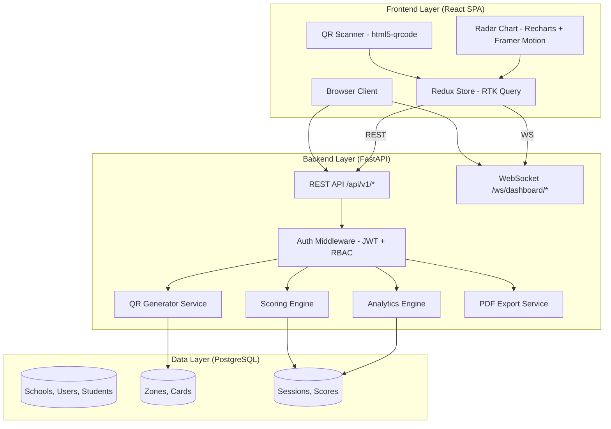

# SOFTWARE REQUIREMENTS SPECIFICATION (SRS)
## Zonara Character Analytics (Enterprise Edition)
### Mengacu pada Standar IEEE 830-1998

| Atribut | Keterangan |
|---------|-----------|
| **Nomor Dokumen** | ZCA-SRS-2026-001 |
| **Versi** | 1.0 (Draft) |
| **Tanggal** | 24 Maret 2026 |
| **Klien** | Azhar M |
| **Status** | Draft — Menunggu Persetujuan |

---

## Riwayat Revisi

| Versi | Tanggal | Penulis | Deskripsi Perubahan |
|-------|---------|---------|---------------------|
| 1.0 | 24/03/2026 | Azhar M | Draft awal SRS berdasarkan hasil elisitasi kebutuhan |

---

## Daftar Isi

1. [Pendahuluan](#10-pendahuluan)
2. [Deskripsi Keseluruhan](#20-deskripsi-keseluruhan)
3. [Kebutuhan Fungsional](#30-kebutuhan-fungsional)
4. [Kebutuhan Non-Fungsional](#40-kebutuhan-non-fungsional)
5. [Kebutuhan Antarmuka Eksternal](#50-kebutuhan-antarmuka-eksternal)

---

## 1.0 Pendahuluan

### 1.1 Tujuan Dokumen

Dokumen *Software Requirements Specification* (SRS) ini disusun untuk mendefinisikan secara komprehensif seluruh kebutuhan fungsional dan non-fungsional dari sistem **Zonara Character Analytics (Enterprise Edition)**. Dokumen ini berfungsi sebagai kontrak teknis antara pemangku kepentingan (*stakeholder*) dan tim pengembang, serta menjadi acuan utama dalam proses perancangan, implementasi, pengujian, dan validasi sistem.

Dokumen ini mengacu pada standar **IEEE 830-1998** (*IEEE Recommended Practice for Software Requirements Specifications*) dan ditulis dalam Bahasa Indonesia untuk memudahkan pemahaman seluruh pihak terkait.

### 1.2 Ruang Lingkup Sistem

**Zonara Character Analytics (Enterprise Edition)** adalah sistem *web-based* berskala kabupaten yang dirancang untuk:

1. **Mengonversi data kualitatif** dari simulasi board game fisik menjadi **diagnostik kuantitatif** berbasis Radar Chart.
2. **Mendeteksi secara dini** kerentanan moral siswa Sekolah Dasar melalui mekanisme *Flag Intervensi* otomatis.
3. **Melacak pertumbuhan karakter** siswa secara longitudinal (*time-series*) dengan evaluasi bulanan.
4. **Menyinkronkan secara real-time** pemindaian kartu fisik (QR code) dengan pembaruan dashboard digital melalui WebSocket.

Sistem menggunakan arsitektur **Decoupled** (React.js SPA ↔ FastAPI REST/WebSocket ↔ PostgreSQL) dan mengacu pada **CASEL Social-Emotional Learning (SEL) Framework** sebagai landasan ilmiah pemetaan karakter.

### 1.3 Definisi, Akronim, dan Singkatan

| Istilah | Definisi |
|---------|----------|
| **Phygital** | Pendekatan yang mengintegrasikan interaksi fisik (*physical*) dengan sistem digital (*digital*) secara simultan |
| **CASEL Framework** | *Collaborative for Academic, Social, and Emotional Learning* — kerangka kerja internasional untuk pendidikan sosial-emosional yang terdiri dari lima kompetensi inti |
| **SEL** | *Social-Emotional Learning* — pembelajaran sosial-emosional |
| **Radar Chart** | Grafik jaring laba-laba yang menampilkan data multidimensi dalam format radial; digunakan untuk memvisualisasikan profil karakter |
| **Flag Intervensi** | Penanda otomatis yang muncul ketika skor siswa pada suatu dimensi berada di bawah ambang batas yang ditentukan |
| **RBAC** | *Role-Based Access Control* — mekanisme kontrol akses berdasarkan peran pengguna |
| **JWT** | *JSON Web Token* — standar terbuka untuk transmisi informasi aman antar pihak dalam format JSON |
| **WebSocket** | Protokol komunikasi dua arah (*full-duplex*) melalui koneksi TCP tunggal, memungkinkan *push notification* dari server ke klien |
| **RTK Query** | Fitur *data fetching* dan *caching* bawaan Redux Toolkit untuk mengelola *API calls* secara efisien |
| **Decoupled Architecture** | Arsitektur perangkat lunak di mana frontend dan backend beroperasi sebagai layanan independen yang berkomunikasi melalui API |
| **Multi-Tenant** | Arsitektur database yang melayani beberapa organisasi (sekolah) dalam satu *instance* aplikasi |
| **Docker Compose** | Alat untuk mendefinisikan dan menjalankan aplikasi Docker multi-kontainer |
| **KRENOVA** | Kreativitas dan Inovasi — program pemerintah daerah untuk mendorong inovasi |
| **Positive Framing** | Pendekatan penyajian data yang menggunakan terminologi positif untuk menghindari pelabelan negatif |

### 1.4 Referensi

| No. | Referensi |
|-----|-----------|
| 1 | IEEE Std 830-1998, *IEEE Recommended Practice for Software Requirements Specifications* |
| 2 | IEEE Std 1016-2009, *IEEE Standard for Information Technology — Systems Design — Software Design Descriptions* |
| 3 | IEEE Std 829-2008, *IEEE Standard for Software and System Test Documentation* |
| 4 | CASEL (2020), *CASEL's SEL Framework: What Are the Core Competence Areas and Where Are They Promoted?*, Collaborative for Academic, Social, and Emotional Learning |
| 5 | Project Charter — Zonara Character Analytics (Enterprise Edition), Versi 2.0, 24 Maret 2026 |
| 6 | FastAPI Documentation, https://fastapi.tiangolo.com/ |
| 7 | OpenAPI Specification 3.0, https://spec.openapis.org/oas/v3.0.0 |

---

## 2.0 Deskripsi Keseluruhan

### 2.1 Perspektif Produk

Zonara Character Analytics (Enterprise Edition) merupakan sistem *standalone* yang dibangun dari nol (*greenfield*) menggunakan arsitektur **Decoupled** dengan pemisahan tanggung jawab (*Separation of Concerns*) yang jelas antara tiga lapisan utama:

Sistem ini **tidak bergantung** pada sistem informasi sekolah yang sudah ada (seperti Dapodik) dan beroperasi secara independen dengan manajemen data mandiri.

### 2.2 Fungsi Utama Produk

| Kode | Fungsi | Deskripsi |
|------|--------|-----------|
| FP-01 | **QR Scan & Score** | Pemindaian QR code pada kartu fisik untuk identifikasi misi, diikuti penilaian guru (Berhasil/Gagal) |
| FP-02 | **Live Radar Dashboard** | Visualisasi Radar Chart yang beranimasi secara real-time saat skor baru diinput melalui WebSocket push |
| FP-03 | **Flag Intervensi Otomatis** | Deteksi anomali perilaku berdasarkan perbandingan skor individu dengan rata-rata kelas |
| FP-04 | **Growth Tracking** | Pelacakan perkembangan karakter per dimensi dalam format *time-series* bulanan |
| FP-05 | **Narrative Insight** | Pembuatan narasi deskriptif otomatis berdasarkan pola skor menggunakan *simple heuristic logic* |
| FP-06 | **Admin QR Generator** | Pembuatan dan pencetakan QR code untuk seluruh kartu permainan |
| FP-07 | **PDF Report Export** | Pembuatan laporan akademik siswa dan ringkasan kelas dalam format PDF bergaya formal |
| FP-08 | **Focus/Presentation Mode** | Mode tampilan *full-screen* tanpa navigasi untuk proyektor kelas |

### 2.3 Karakteristik Pengguna

| Tipe Pengguna | Tingkat Teknis | Frekuensi Penggunaan | Kebutuhan Utama |
|---------------|:--------------:|:--------------------:|-----------------|
| **Guru BK** | Dasar–Menengah | Harian (saat sesi game) | Kemudahan scan QR, tampilan dashboard jelas, cetak laporan |
| **Wali Kelas** | Dasar | Mingguan–Bulanan | Monitoring perkembangan kelas, ringkasan visual |
| **Orang Tua** | Dasar | Bulanan | Sertifikat karakter anak, ringkasan positif |
| **Admin Sistem** | Menengah–Tinggi | Sesuai kebutuhan | Manajemen sekolah, pengguna, dan konfigurasi sistem |

### 2.4 Batasan & Asumsi

#### 2.4.1 Batasan Teknis

1. Sistem di-*deploy* menggunakan **Docker Compose** yang memerlukan Docker Engine pada server target.
2. QR scanning memerlukan browser dengan dukungan **WebRTC** dan **getUserMedia API** (Chrome 53+, Edge 12+, Firefox 36+).
3. WebSocket memerlukan koneksi internet yang **persisten**; jika terputus, sistem akan melakukan *auto-reconnect* dengan *fallback* ke REST polling.
4. Kapasitas awal dirancang untuk menangani hingga **50 sekolah** (multi-tenant shared schema).

#### 2.4.2 Asumsi Operasional

1. Sekolah yang berpartisipasi menyediakan minimal 1 perangkat berkamera dan koneksi internet.
2. Guru BK telah menerima pelatihan operasional minimal 1 sesi (±2 jam).
3. Kartu permainan fisik dicetak bersama QR code yang dihasilkan oleh fitur QR Generator sistem.

---

## 3.0 Kebutuhan Fungsional

Setiap kebutuhan fungsional disajikan dalam format tabel dengan kolom: **ID**, **Deskripsi**, **Prioritas** (High/Medium/Low), dan **Sumber** (hasil elisitasi).

### FR-001: Autentikasi JWT & Role-Based Access Control (RBAC)

| ID | Deskripsi | Prioritas | Sumber |
|----|-----------|:---------:|--------|
| FR-001.1 | Sistem **harus** menyediakan halaman registrasi untuk pengguna dengan role Guru BK dan Orang Tua, mencakup input: username, password, nama lengkap, sekolah, dan role | High | Elisitasi Q4 |
| FR-001.2 | Sistem **harus** melakukan autentikasi menggunakan JWT dengan mekanisme *access token* (masa berlaku 30 menit) dan *refresh token* (masa berlaku 7 hari) | High | Elisitasi Q4 |
| FR-001.3 | Sistem **harus** meng-hash password menggunakan algoritma bcrypt sebelum disimpan ke database | High | Elisitasi Q5 |
| FR-001.4 | Sistem **harus** menerapkan RBAC di *application layer* (FastAPI middleware) dengan 3 tingkat akses: Admin/Guru BK (full), Wali Kelas (class-scoped), Orang Tua (child-scoped, read-only) | High | Elisitasi Q4 |
| FR-001.5 | Sistem **harus** menampilkan UI secara kondisional berdasarkan role pengguna yang sedang login (satu URL, tampilan berbeda) | Medium | Elisitasi Q4 |
| FR-001.6 | Sistem **harus** mengarahkan pengguna ke halaman login jika *access token* kedaluwarsa dan *refresh token* gagal diperbarui | High | Standar keamanan |

### FR-002: Manajemen Sesi Permainan & Data Siswa

| ID | Deskripsi | Prioritas | Sumber |
|----|-----------|:---------:|--------|
| FR-002.1 | Sistem **harus** memungkinkan Guru BK membuat sesi permainan baru dengan memilih kelas dan menambahkan siswa sebagai pemain | High | Elisitasi Q1 |
| FR-002.2 | Sistem **harus** menghasilkan kode sesi unik (6 karakter alfanumerik) saat sesi dibuat | High | Desain sistem |
| FR-002.3 | Sistem **harus** menyimpan data siswa (NIS, nama lengkap, kelas, sekolah) dan memungkinkan operasi CRUD oleh Admin/Guru BK | High | Elisitasi Q6 |
| FR-002.4 | Sistem **harus** mendukung *multi-tenant* dengan kolom `school_id` pada setiap tabel utama agar data antar-sekolah terisolasi secara logis | High | Elisitasi Q6 |
| FR-002.5 | Sistem **harus** mencatat waktu mulai dan selesai setiap sesi, serta mengubah status sesi dari `active` menjadi `completed` saat sesi diakhiri | Medium | Desain sistem |

### FR-003: QR Scanner Decoder (Frontend-Side)

| ID | Deskripsi | Prioritas | Sumber |
|----|-----------|:---------:|--------|
| FR-003.1 | Sistem **harus** mengaktifkan kamera perangkat pengguna melalui *browser API* (`getUserMedia`) untuk memindai QR code pada kartu permainan | High | Elisitasi Q1, Q6 |
| FR-003.2 | Sistem **harus** mendekode QR code di sisi frontend menggunakan library `html5-qrcode` dan mengirimkan `card_id` hasil dekode ke backend melalui REST API | High | Elisitasi Q6 |
| FR-003.3 | Sistem **harus** menampilkan *pop-up* berisi judul misi, deskripsi misi, dan zona kartu (warna) setelah QR code berhasil dipindai | High | Elisitasi Q1 |
| FR-003.4 | Sistem **harus** menyediakan dua tombol aksi pada *pop-up* kartu: **"Berhasil"** (result=1) dan **"Gagal"** (result=0) untuk penilaian guru | High | Elisitasi Q1 |
| FR-003.5 | Sistem **harus** menyediakan mekanisme *fallback* berupa input teks manual untuk memasukkan ID kartu apabila pemindaian QR gagal | Medium | Elisitasi Q1 |

### FR-004: WebSocket Live-Sync Radar Chart (Push Update)

| ID | Deskripsi | Prioritas | Sumber |
|----|-----------|:---------:|--------|
| FR-004.1 | Sistem **harus** membuka koneksi WebSocket per sesi permainan (`/ws/dashboard/{session_id}`) antara backend dan setiap klien yang terhubung ke dashboard | High | Elisitasi Q1 |
| FR-004.2 | Sistem **harus** melakukan *broadcast* data skor terbaru melalui WebSocket ke seluruh klien yang terhubung setiap kali guru menekan tombol penilaian | High | Elisitasi Q1 |
| FR-004.3 | Sistem **harus** memperbarui Radar Chart di dashboard secara real-time dengan animasi transisi yang halus menggunakan Framer Motion (durasi transisi ≤ 500ms) | High | Elisitasi Q5 |
| FR-004.4 | Sistem **harus** menampilkan indikator status koneksi WebSocket (terhubung/terputus) pada antarmuka dashboard | Medium | Mitigasi risiko |
| FR-004.5 | Sistem **harus** melakukan *auto-reconnect* jika koneksi WebSocket terputus, dengan interval *exponential backoff* (1s, 2s, 4s, maks 30s) | Medium | Mitigasi risiko |

### FR-005: Admin Card & QR Generator (Export to PDF)

| ID | Deskripsi | Prioritas | Sumber |
|----|-----------|:---------:|--------|
| FR-005.1 | Sistem **harus** menyediakan halaman *Admin QR Generator* yang menampilkan daftar seluruh kartu beserta QR code-nya | High | Elisitasi Q8 |
| FR-005.2 | Sistem **harus** men-*generate* QR code unik untuk setiap kartu berdasarkan `qr_code` field di tabel `cards`, menggunakan library `qrcode` + `Pillow` di backend | High | Elisitasi Q8 |
| FR-005.3 | Sistem **harus** menyediakan endpoint untuk mengunduh QR code individual per kartu dalam format PNG | High | Elisitasi Q8 |
| FR-005.4 | Sistem **harus** menyediakan endpoint untuk mengunduh seluruh QR code dalam satu file ZIP | Medium | Elisitasi Q8 |
| FR-005.5 | Sistem **harus** menyediakan endpoint untuk menghasilkan halaman *print-ready* berisi grid QR code beserta label (nama kartu, zona, warna) yang siap dicetak | High | Elisitasi Q8 |

### FR-006: Anomaly Detection — Visual Alert System (Flag Intervensi)

| ID | Deskripsi | Prioritas | Sumber |
|----|-----------|:---------:|--------|
| FR-006.1 | Sistem **harus** menghitung rata-rata skor per dimensi karakter untuk seluruh siswa dalam satu kelas | High | Elisitasi Q3 |
| FR-006.2 | Sistem **harus** membandingkan skor setiap siswa per dimensi dengan rata-rata kelas dan menandai (*flag*) apabila skor siswa < 80% dari rata-rata kelas pada dimensi tersebut | High | Elisitasi Q3 |
| FR-006.3 | Sistem **harus** menampilkan ikon visual ⚠️ berwarna merah pada dimensi yang ter-*flag* di Radar Chart dan tabel ringkasan | High | Elisitasi Q3 |
| FR-006.4 | Sistem **harus** menyajikan daftar siswa dengan *flag* intervensi di halaman dashboard kelas, disertai dimensi mana yang memerlukan perhatian | High | Elisitasi Q3 |
| FR-006.5 | Sistem **harus** menggunakan terminologi *positive framing*: "Area Kekuatan" untuk skor tinggi dan "Area Pertumbuhan" untuk skor yang memerlukan penguatan | High | Elisitasi Q5 |

---

## 4.0 Kebutuhan Non-Fungsional

### 4.1 Performa

| ID | Deskripsi | Target |
|----|-----------|--------|
| NFR-01 | Waktu respons API REST untuk operasi CRUD standar | ≤ 500ms (persentil ke-95) |
| NFR-02 | Latensi WebSocket push dari saat guru menekan tombol penilaian hingga Radar Chart beranimasi di klien lain | ≤ 500ms |
| NFR-03 | Waktu muat halaman pertama (*First Contentful Paint*) | ≤ 2 detik |
| NFR-04 | Kemampuan menangani koneksi WebSocket simultan | ≥ 50 koneksi per sesi |
| NFR-05 | Waktu *generate* PDF laporan siswa individual | ≤ 3 detik |

### 4.2 Keamanan

| ID | Deskripsi |
|----|-----------|
| NFR-06 | Seluruh password pengguna di-*hash* menggunakan algoritma **bcrypt** dengan *salt round* ≥ 12 |
| NFR-07 | Komunikasi antara frontend dan backend menggunakan HTTPS (wajib untuk *production*) |
| NFR-08 | JWT *access token* memiliki masa berlaku maksimal **30 menit**; *refresh token* **7 hari** |
| NFR-09 | RBAC diterapkan pada setiap endpoint API melalui FastAPI *dependency injection* |
| NFR-10 | Data karakter siswa disajikan dengan **positive framing** untuk menghindari pelabelan negatif (*data anonymization* terhadap terminology) |
| NFR-11 | Orang tua **hanya** dapat mengakses data anak yang terhubung dengan akunnya (isolasi *child-scoped*) |

### 4.3 Keandalan & Portabilitas

| ID | Deskripsi |
|----|-----------|
| NFR-12 | Sistem target memiliki *uptime* ≥ **99.5%** pada lingkungan produksi |
| NFR-13 | Seluruh komponen sistem (frontend, backend, database) dikemas dalam **Docker container** dan dikelola melalui `docker-compose.yml` |
| NFR-14 | Sistem dapat di-*deploy* pada lingkungan cloud VPS (Railway, DigitalOcean) maupun server on-premise tanpa modifikasi signifikan |
| NFR-15 | Database PostgreSQL menggunakan **connection pooling** (asyncpg) untuk menangani *concurrent access* |
| NFR-16 | WebSocket memiliki mekanisme **auto-reconnect** dengan *exponential backoff* saat koneksi terputus |

---

## 5.0 Kebutuhan Antarmuka Eksternal

### 5.1 Antarmuka Pengguna (*User Interface*)

| Aspek | Spesifikasi |
|-------|-----------|
| **Framework CSS** | Tailwind CSS v3 — *utility-first* dengan kustomisasi tema Zonara |
| **Palet Warna** | Zona Biru `#3B82F6`, Zona Hijau `#22C55E`, Zona Kuning `#F59E0B`, Zona Merah `#EF4444`, Aksen Emas `#D4AF37` |
| **Animasi** | Framer Motion — transisi Radar Chart, *page transitions*, *micro-interactions* |
| **Responsivitas** | *Mobile-first* responsive design (breakpoints: sm, md, lg, xl) |
| **Aksesibilitas** | Kontras warna WCAG AA, label ARIA pada elemen interaktif |
| **Presentation Mode** | *Focus Mode* — tampilan *full-screen*, font besar, tanpa sidebar/navigasi, optimal untuk proyektor |
| **Bahasa Antarmuka** | Bahasa Indonesia |

### 5.2 Antarmuka Perangkat Keras (*Hardware Interface*)

| Perangkat | Spesifikasi | Kegunaan |
|-----------|-----------|----------|
| **Kamera / Webcam** | Resolusi minimal 720p, diakses via `navigator.mediaDevices.getUserMedia()` | Pemindaian QR code kartu permainan |
| **Proyektor / Layar Eksternal** | Resolusi minimal 1024×768 | Menampilkan dashboard Focus Mode saat sesi permainan |
| **Printer** | Printer standar A4 | Mencetak halaman QR code kartu dan laporan PDF |

### 5.3 Antarmuka Perangkat Lunak (*Software Interface*)

| Sistem Eksternal | Protokol | Deskripsi |
|------------------|----------|-----------|
| **Frontend ↔ Backend** | REST API (OpenAPI 3.0) | Operasi CRUD, autentikasi, analitik |
| **Frontend ↔ Backend** | WebSocket | *Push notification* pembaruan skor ke dashboard |
| **Backend ↔ PostgreSQL** | asyncpg (TCP) | Query database asynchronous dengan connection pooling |
| **Swagger UI** | HTTP (auto-generated) | Dokumentasi API interaktif di `/docs` |

### 5.4 Antarmuka Komunikasi (*Communication Interface*)

| Protokol | Penggunaan |
|----------|-----------|
| **HTTPS** | Seluruh komunikasi REST API (*production*) |
| **WSS** | Koneksi WebSocket terenkripsi (*production*) |
| **HTTP/WS** | Komunikasi lokal untuk *development* (`localhost`) |

---

## Glosarium

| Istilah | Definisi |
|---------|----------|
| Anomaly Detection | Proses identifikasi pola data yang menyimpang secara signifikan dari norma |
| Board Game Fisik | Permainan papan fisik Zonara yang dimainkan siswa secara tatap muka |
| Greenfield | Pengembangan sistem dari nol, tanpa ketergantungan pada sistem sebelumnya |
| Heuristic Logic | Pendekatan pemecahan masalah menggunakan aturan praktis untuk menghasilkan solusi yang cukup baik |
| Overlay Chart | Teknik visualisasi dengan menumpuk dua grafik dalam satu area untuk perbandingan |
| Screening Tool | Instrumen skrining awal yang mengidentifikasi individu yang mungkin memerlukan evaluasi lebih lanjut |
| Shared Schema | Pola multi-tenant di mana seluruh tenant berbagi struktur tabel yang sama dalam satu database |
| Time-Series | Data yang direkam secara berurutan berdasarkan interval waktu tertentu |

---

> **Catatan:** Dokumen SRS ini bersifat *draft* dan akan diiterasi berdasarkan masukan dari pemangku kepentingan. Versi final akan disertakan sebagai lampiran proposal KRENOVA.
