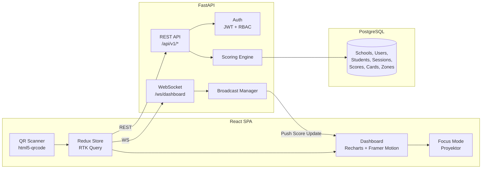

# Implementation Plan — Zonara Character Analytics (Enterprise Edition)

Membangun **Decoupled Architecture** (React ↔ FastAPI ↔ PostgreSQL) untuk sistem analitik karakter siswa SD berbasis CASEL SEL Framework, dengan real-time WebSocket sync, animated Radar Chart, QR code generator, dan Docker deployment.

> **Keputusan Final:** Tailwind CSS **v3** (stable) · PostgreSQL **via Docker only** · Fitur **Generate & Print QR** untuk 40 kartu ✅

---

## Arsitektur Sistem



---

## Monorepo Structure

```
Zonara/
├── docker-compose.yml
├── README.md
│
├── backend/
│   ├── Dockerfile
│   ├── requirements.txt
│   ├── alembic/                    # DB migrations
│   │   └── versions/
│   ├── app/
│   │   ├── main.py                 # FastAPI entry + CORS + lifespan
│   │   ├── config.py               # Settings (env-based)
│   │   ├── database.py             # asyncpg connection pool
│   │   ├── models/
│   │   │   ├── __init__.py
│   │   │   ├── school.py
│   │   │   ├── user.py
│   │   │   ├── student.py
│   │   │   ├── zone.py
│   │   │   ├── card.py
│   │   │   ├── session.py
│   │   │   └── score.py
│   │   ├── schemas/                 # Pydantic request/response
│   │   │   ├── auth.py
│   │   │   ├── session.py
│   │   │   ├── score.py
│   │   │   └── analytics.py
│   │   ├── routers/
│   │   │   ├── auth.py              # POST /login, /register, /refresh
│   │   │   ├── schools.py           # CRUD schools
│   │   │   ├── students.py          # CRUD students
│   │   │   ├── sessions.py          # Game session lifecycle
│   │   │   ├── scores.py            # Record & query scores
│   │   │   ├── analytics.py         # Radar data, flags, time-series
│   │   │   ├── reports.py           # PDF generation endpoint
│   │   │   └── qr_generator.py      # Generate QR codes untuk kartu
│   │   ├── services/
│   │   │   ├── auth_service.py      # JWT create/verify, bcrypt
│   │   │   ├── scoring_service.py   # Agregasi dimensi, flag detection
│   │   │   ├── analytics_service.py # Radar overlay, narrative insight
│   │   │   ├── qr_service.py        # Generate QR image (qrcode + Pillow)
│   │   │   ├── report_service.py    # PDF generation (FPDF2)
│   │   │   └── websocket_service.py # Connection manager + broadcast
│   │   ├── middleware/
│   │   │   └── auth_middleware.py    # JWT dependency + role guard
│   │   └── seed.py                  # Seed data (zones, cards, demo)
│   └── tests/
│       ├── test_auth.py
│       ├── test_scoring.py
│       └── test_analytics.py
│
├── frontend/
│   ├── Dockerfile
│   ├── package.json
│   ├── tailwind.config.js
│   ├── vite.config.js
│   ├── index.html
│   ├── public/
│   │   └── zonara-logo.svg
│   └── src/
│       ├── main.jsx
│       ├── App.jsx                   # Router + auth guard
│       ├── index.css                 # Tailwind + custom Zonara theme
│       ├── store/
│       │   ├── store.js              # Redux store config
│       │   ├── apiSlice.js           # RTK Query base API
│       │   ├── authSlice.js          # Auth state (token, user, role)
│       │   ├── sessionSlice.js       # Active game session
│       │   └── websocketMiddleware.js # WS connection manager
│       ├── pages/
│       │   ├── LoginPage.jsx         # Login (guru + orang tua)
│       │   ├── RegisterPage.jsx      # Register guru
│       │   ├── GameSessionPage.jsx   # QR scan + scoring flow
│       │   ├── DashboardPage.jsx     # Radar overlay + flags
│       │   ├── GrowthTrackerPage.jsx # Time-series + narrative
│       │   ├── ParentViewPage.jsx    # Ringkasan anak (read-only)
│       │   ├── ReportsPage.jsx       # PDF download
│       │   ├── QRGeneratorPage.jsx   # Generate & print QR codes kartu
│       │   └── FocusModePage.jsx     # Proyektor (full-screen radar)
│       ├── components/
│       │   ├── layout/
│       │   │   ├── Sidebar.jsx
│       │   │   ├── Header.jsx
│       │   │   └── ProtectedRoute.jsx
│       │   ├── charts/
│       │   │   ├── RadarChart.jsx     # Recharts + Framer Motion
│       │   │   ├── GrowthLineChart.jsx
│       │   │   └── InterventionFlag.jsx
│       │   ├── scanner/
│       │   │   └── QRScanner.jsx      # html5-qrcode wrapper
│       │   ├── session/
│       │   │   ├── PlayerList.jsx
│       │   │   ├── CardPopup.jsx      # Misi kartu + tombol Berhasil/Gagal
│       │   │   └── SessionControl.jsx
│       │   └── common/
│       │       ├── Button.jsx
│       │       ├── Modal.jsx
│       │       └── LoadingSpinner.jsx
│       └── utils/
│           ├── constants.js          # Zone colors, thresholds
│           └── helpers.js
│
└── docs/
    ├── SRS_IEEE830.md
    ├── SAD_IEEE1016.md
    └── TestPlan_IEEE829.md
```

---

## Database Schema (PostgreSQL)

```sql
-- Shared schema with school_id (multi-tenant)

CREATE TABLE schools (
    id SERIAL PRIMARY KEY,
    name VARCHAR(255) NOT NULL,
    address TEXT,
    created_at TIMESTAMP DEFAULT NOW()
);

CREATE TABLE users (
    id SERIAL PRIMARY KEY,
    username VARCHAR(100) UNIQUE NOT NULL,
    password_hash VARCHAR(255) NOT NULL,
    full_name VARCHAR(255) NOT NULL,
    role VARCHAR(20) CHECK(role IN ('admin','guru_bk','wali_kelas','orang_tua')) NOT NULL,
    school_id INTEGER REFERENCES schools(id) ON DELETE CASCADE,
    class_name VARCHAR(50),
    child_student_id INTEGER,  -- orang_tua → link ke students.id
    created_at TIMESTAMP DEFAULT NOW()
);

CREATE TABLE students (
    id SERIAL PRIMARY KEY,
    nis VARCHAR(50) UNIQUE,
    full_name VARCHAR(255) NOT NULL,
    class_name VARCHAR(50) NOT NULL,
    school_id INTEGER REFERENCES schools(id) ON DELETE CASCADE,
    created_at TIMESTAMP DEFAULT NOW()
);

CREATE TABLE zones (
    id SERIAL PRIMARY KEY,
    code VARCHAR(20) UNIQUE NOT NULL,     -- 'blue','green','yellow','red'
    name VARCHAR(100) NOT NULL,            -- 'Self-Awareness', etc.
    color_hex VARCHAR(7) NOT NULL,
    sel_dimension VARCHAR(100) NOT NULL,
    description TEXT
);

CREATE TABLE cards (
    id SERIAL PRIMARY KEY,
    qr_code VARCHAR(100) UNIQUE NOT NULL,
    zone_id INTEGER REFERENCES zones(id),
    title VARCHAR(255) NOT NULL,
    description TEXT NOT NULL,
    difficulty VARCHAR(20) DEFAULT 'normal'
);

CREATE TABLE game_sessions (
    id SERIAL PRIMARY KEY,
    session_code VARCHAR(10) UNIQUE NOT NULL,
    school_id INTEGER REFERENCES schools(id) ON DELETE CASCADE,
    class_name VARCHAR(50) NOT NULL,
    teacher_id INTEGER REFERENCES users(id),
    status VARCHAR(20) DEFAULT 'active',
    started_at TIMESTAMP DEFAULT NOW(),
    ended_at TIMESTAMP
);

CREATE TABLE session_players (
    id SERIAL PRIMARY KEY,
    session_id INTEGER REFERENCES game_sessions(id) ON DELETE CASCADE,
    student_id INTEGER REFERENCES students(id),
    UNIQUE(session_id, student_id)
);

CREATE TABLE scores (
    id SERIAL PRIMARY KEY,
    session_id INTEGER REFERENCES game_sessions(id) ON DELETE CASCADE,
    student_id INTEGER REFERENCES students(id),
    card_id INTEGER REFERENCES cards(id),
    zone_id INTEGER REFERENCES zones(id),
    result SMALLINT CHECK(result IN (0, 1)) NOT NULL,
    scored_at TIMESTAMP DEFAULT NOW()
);

-- Performance indexes
CREATE INDEX idx_scores_session ON scores(session_id);
CREATE INDEX idx_scores_student ON scores(student_id);
CREATE INDEX idx_scores_zone ON scores(zone_id);
CREATE INDEX idx_students_school ON students(school_id);
CREATE INDEX idx_sessions_school ON game_sessions(school_id);
```

---

## API Endpoints (OpenAPI 3.0)

### Auth (`/api/v1/auth`)
| Method | Path | Deskripsi |
|--------|------|-----------|
| POST | `/register` | Registrasi guru/orang tua |
| POST | `/login` | Login → JWT access + refresh token |
| POST | `/refresh` | Refresh access token |
| GET | `/me` | Profil user saat ini |

### Sessions (`/api/v1/sessions`)
| Method | Path | Deskripsi |
|--------|------|-----------|
| POST | `/` | Buat sesi permainan baru |
| GET | `/{id}` | Detail sesi + pemain |
| POST | `/{id}/players` | Tambah siswa ke sesi |
| PATCH | `/{id}/complete` | Akhiri sesi |

### Scores (`/api/v1/scores`)
| Method | Path | Deskripsi |
|--------|------|-----------|
| POST | `/` | Catat skor (card_id, student_id, result) + WS broadcast |
| GET | `/session/{id}` | Semua skor dalam sesi |

### Analytics (`/api/v1/analytics`)
| Method | Path | Deskripsi |
|--------|------|-----------|
| GET | `/radar/{student_id}` | Data radar chart individu |
| GET | `/radar/class/{class}` | Overlay individu vs rata-rata kelas |
| GET | `/flags/{class}` | Siswa dengan flag intervensi |
| GET | `/growth/{student_id}` | Time-series perkembangan bulanan |
| GET | `/narrative/{student_id}` | Narrative insight otomatis |

### Reports (`/api/v1/reports`)
| Method | Path | Deskripsi |
|--------|------|-----------|
| GET | `/student/{id}/pdf` | Download PDF laporan siswa |
| GET | `/class/{class}/pdf` | Download PDF ringkasan kelas |

### QR Generator (`/api/v1/qr`)
| Method | Path | Deskripsi |
|--------|------|-----------|
| GET | `/cards` | Generate QR codes untuk semua kartu (ZIP) |
| GET | `/cards/{id}` | Generate QR code untuk 1 kartu (PNG) |
| GET | `/cards/printable` | Generate halaman print-ready (grid QR + label) |

### WebSocket
| Path | Deskripsi |
|------|-----------|
| `ws://host/ws/dashboard/{session_id}` | Live push radar chart update |

---

## Scoring & Analytics Logic

### Perhitungan Dimensi
```
skor_dimensi = SUM(result) per zone_id untuk student_id dalam session_id
radar_data = [skor_blue, skor_green, skor_yellow, skor_red]
```

### Flag Intervensi
```
rata_rata_kelas[dimensi] = AVG(skor_dimensi) untuk semua siswa di kelas
flag = skor_siswa[dimensi] < 0.8 × rata_rata_kelas[dimensi]
```

### Narrative Insight (Simple Heuristic)
```python
if delta > 0: "menunjukkan peningkatan pada {dimensi}"
if delta < 0: "memerlukan penguatan pada {dimensi}"
if konsisten_tinggi: "konsistensi tinggi pada {dimensi}"
```

---

## User Review Required

> [!NOTE]
> **Semua keputusan telah dikonfirmasi ✅**
> 1. ✅ Tailwind CSS **v3** (stable)
> 2. ✅ PostgreSQL **via Docker only**
> 3. ✅ Fitur **Generate & Print QR** wajib ada (endpoint + halaman dedicated)

---

## Verification Plan

### Automated Tests
```bash
# Backend unit tests
cd backend && pytest tests/ -v

# Database connection test
python -c "from app.database import test_connection; test_connection()"
```

### Browser Tests
1. Buka `http://localhost:5173` → verifikasi login page
2. Login guru → navigasi ke Game Session → verifikasi QR scanner aktif
3. Buka Dashboard → verifikasi Radar Chart render dengan animasi
4. Buka Focus Mode → verifikasi full-screen tanpa sidebar
5. Download PDF → verifikasi format dan grafik

### Manual Verification
1. QR Scan kartu fisik → verifikasi card popup muncul benar
2. Tekan "Berhasil" → verifikasi Radar Chart update di tab proyektor via WebSocket
3. Export PDF → verifikasi tampilan akademik professional
