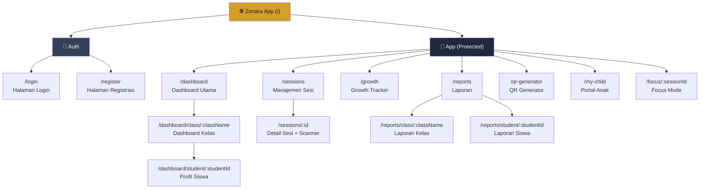
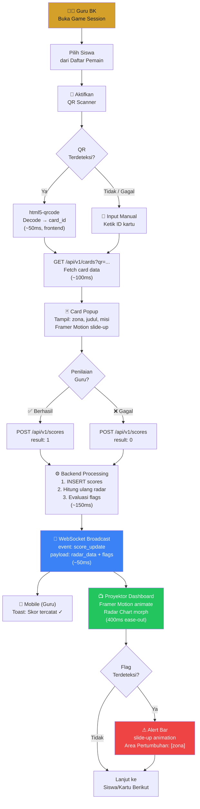

# UI DESIGN SPECIFICATION
## Zonara Character Analytics (Enterprise Edition)
### Mengacu pada WCAG 2.1 AA & Material Design Principles

| Atribut | Keterangan |
|---------|-----------|
| **Nomor Dokumen** | ZCA-UIDS-2026-001 |
| **Versi** | 1.0 |
| **Tanggal** | 25 Maret 2026 |
| **Klien** | Azhar M |
| **Framework CSS** | Tailwind CSS v3 |
| **Animasi** | Framer Motion 11.x |
| **Charting** | Recharts 2.x |
| **Dokumen Acuan** | ZCA-SRS-2026-001, ZCA-SAD-2026-001 |
| **Status** | Draft — Menunggu Persetujuan |

---

## Riwayat Revisi

| Versi | Tanggal | Penulis | Deskripsi |
|-------|---------|---------|-----------|
| 1.0 | 25/03/2026 | Azhar M | Draft awal UI Design Specification |

---

## Daftar Isi

1. [Design System](#10-design-system)
2. [Sitemap / Navigasi](#20-sitemap--navigasi)
3. [Wireframe Tekstual](#30-wireframe-tekstual)
4. [UX Flow](#40-ux-flow)
5. [Aksesibilitas (WCAG 2.1)](#50-aksesibilitas-wcag-21)
6. [Responsive Design](#60-responsive-design)

---

## 1.0 Design System

### 1.1 Palet Warna

#### 1.1.1 Warna Identitas Zona (Primary Brand)

Keempat warna zona merupakan **identitas inti** sistem Zonara, mewakili dimensi karakter CASEL:

| Zona | Nama Warna | Hex | HSL | Tailwind Config | Kegunaan |
|:----:|-----------|:---:|-----|:---------------:|----------|
| 🔵 **Biru** | Zonara Blue | `#3B82F6` | `217° 91% 60%` | `zonara-blue` | Self-Awareness — sumbu radar, badge, chart trace |
| 🟢 **Hijau** | Zonara Green | `#22C55E` | `142° 71% 45%` | `zonara-green` | Relationship Skills — badge zona, chart trace |
| 🟡 **Kuning** | Zonara Yellow | `#F59E0B` | `38° 92% 50%` | `zonara-yellow` | Decision Making — badge zona, chart trace |
| 🔴 **Merah** | Zonara Red | `#EF4444` | `0° 84% 60%` | `zonara-red` | Assertiveness — badge zona, flag intervensi |

#### 1.1.2 Warna Aksen

| Nama | Hex | HSL | Tailwind Config | Kegunaan |
|------|:---:|-----|:---------------:|----------|
| **Krenova Gold** | `#D4A029` | `42° 70% 50%` | `krenova-gold` | Elemen premium: logo, header accent, badge "KRENOVA Ready", hover CTA |
| **Krenova Gold Light** | `#F5D98C` | `42° 85% 75%` | `krenova-gold-light` | Background subtle, highlight tabel |
| **Krenova Gold Dark** | `#9A7420` | `42° 65% 36%` | `krenova-gold-dark` | Teks di atas gold background |

#### 1.1.3 Warna Netral & UI

| Nama | Hex | Tailwind | Kegunaan |
|------|:---:|:--------:|----------|
| **Background Primary** | `#0F172A` | `slate-900` | Background utama (dark mode) |
| **Background Secondary** | `#1E293B` | `slate-800` | Card, sidebar, panel |
| **Background Tertiary** | `#334155` | `slate-700` | Input field, hover state |
| **Border** | `#475569` | `slate-600` | Border card, divider |
| **Text Primary** | `#F8FAFC` | `slate-50` | Heading, body text utama |
| **Text Secondary** | `#94A3B8` | `slate-400` | Label, caption, placeholder |
| **Text Muted** | `#64748B` | `slate-500` | Hint, disabled text |
| **Surface Success** | `#065F46` | `emerald-800` | Background toast sukses |
| **Surface Warning** | `#92400E` | `amber-800` | Background toast warning |
| **Surface Error** | `#991B1B` | `red-800` | Background toast error |

#### 1.1.4 Konfigurasi Tailwind

```javascript
// tailwind.config.js — Zonara Color Extension
module.exports = {
  theme: {
    extend: {
      colors: {
        'zonara-blue':   '#3B82F6',
        'zonara-green':  '#22C55E',
        'zonara-yellow': '#F59E0B',
        'zonara-red':    '#EF4444',
        'krenova-gold':       '#D4A029',
        'krenova-gold-light': '#F5D98C',
        'krenova-gold-dark':  '#9A7420',
      },
    },
  },
}
```

### 1.2 Tipografi

#### 1.2.1 Font Family

| Tipe | Font | Fallback | Sumber | Alasan |
|------|------|----------|--------|--------|
| **Primary (Sans)** | `Inter` | `system-ui, -apple-system, sans-serif` | Google Fonts | Dirancang untuk UI, x-height tinggi, kerning optimal untuk angka, standar dashboard modern |
| **Monospace** | `JetBrains Mono` | `Consolas, monospace` | Google Fonts | Skor numerik, kode sesi, QR string — tabular nums aligned |

#### 1.2.2 Skala Tipografi

| Token | Elemen | Size | Weight | Line Height | Letter Spacing | Tailwind |
|-------|--------|:----:|:------:|:-----------:|:--------------:|----------|
| `heading-1` | Page title | 30px | 700 (Bold) | 1.2 | -0.02em | `text-3xl font-bold tracking-tight` |
| `heading-2` | Section title | 24px | 600 (Semibold) | 1.3 | -0.01em | `text-2xl font-semibold` |
| `heading-3` | Card title | 20px | 600 (Semibold) | 1.4 | — | `text-xl font-semibold` |
| `body` | Paragraph | 16px | 400 (Regular) | 1.6 | — | `text-base` |
| `body-sm` | Table cell, label | 14px | 400 (Regular) | 1.5 | — | `text-sm` |
| `caption` | Hint, metadata | 12px | 400 (Regular) | 1.4 | 0.02em | `text-xs tracking-wide` |
| `score-display` | Skor besar (Radar center) | 48px | 700 (Bold) | 1.0 | -0.03em | `text-5xl font-bold tracking-tighter` |
| `score-label` | Label sumbu radar | 14px | 600 (Semibold) | 1.2 | — | `text-sm font-semibold` |
| `session-code` | Kode sesi (monospace) | 28px | 700 (Bold) | 1.0 | 0.1em | `font-mono text-2xl font-bold tracking-widest` |

### 1.3 Komponen UI

#### 1.3.1 Button

| Varian | Tailwind Classes | Kegunaan |
|--------|-----------------|----------|
| **Primary** | `bg-krenova-gold hover:bg-krenova-gold-dark text-slate-900 font-semibold px-6 py-3 rounded-lg transition-all duration-200 shadow-md hover:shadow-lg active:scale-[0.98]` | CTA utama: "Masuk", "Mulai Sesi", "Generate PDF" |
| **Secondary** | `bg-slate-700 hover:bg-slate-600 text-slate-50 font-medium px-5 py-2.5 rounded-lg border border-slate-600 transition-colors duration-150` | Aksi sekunder: "Batal", "Kembali" |
| **Success** | `bg-zonara-green/20 hover:bg-zonara-green/30 text-zonara-green font-semibold px-5 py-3 rounded-lg border border-zonara-green/40 transition-all duration-200` | "✅ Berhasil" (penilaian kartu) |
| **Danger** | `bg-zonara-red/20 hover:bg-zonara-red/30 text-zonara-red font-semibold px-5 py-3 rounded-lg border border-zonara-red/40 transition-all duration-200` | "❌ Gagal" (penilaian kartu) |
| **Ghost** | `text-slate-400 hover:text-slate-50 hover:bg-slate-800 px-4 py-2 rounded-lg transition-colors duration-150` | Navigasi sidebar, ikon aksi |
| **Icon** | `p-2 rounded-full hover:bg-slate-700 transition-colors duration-150` | Tombol ikon (close, settings, expand) |

**States:**

```
┌─────────┐  ┌─────────┐  ┌─────────┐  ┌─────────┐
│ Default │→│  Hover  │→│ Active  │→│ Disabled│
│ opacity │  │ lighter │  │ scale   │  │ opacity │
│ 100%    │  │ bg      │  │ 0.98    │  │ 50%     │
│         │  │ shadow  │  │         │  │ cursor  │
│         │  │ +lg     │  │         │  │ default │
└─────────┘  └─────────┘  └─────────┘  └─────────┘
```

#### 1.3.2 Form Input

| Elemen | Tailwind Classes |
|--------|-----------------|
| **Text Input** | `w-full bg-slate-800 border border-slate-600 rounded-lg px-4 py-3 text-slate-50 placeholder:text-slate-500 focus:outline-none focus:ring-2 focus:ring-krenova-gold/50 focus:border-krenova-gold transition-all duration-200` |
| **Select** | `w-full bg-slate-800 border border-slate-600 rounded-lg px-4 py-3 text-slate-50 focus:ring-2 focus:ring-krenova-gold/50 appearance-none cursor-pointer` |
| **Label** | `block text-sm font-medium text-slate-300 mb-1.5` |
| **Error Message** | `text-xs text-zonara-red mt-1 flex items-center gap-1` |
| **Input Group** | `space-y-1.5` (container label + input + error) |

#### 1.3.3 Radar Chart Container

```
┌─────────────────────────────────────────────────────────┐
│  Card Container                                         │
│  bg-slate-800 rounded-2xl border border-slate-700       │
│  p-6 shadow-xl                                          │
│                                                         │
│  ┌───────────────────────────────────────────┐          │
│  │ Header                                     │         │
│  │ "Profil Karakter: [Nama Siswa]"           │         │
│  │ text-xl font-semibold + badge zona flags  │         │
│  └───────────────────────────────────────────┘          │
│                                                         │
│  ┌───────────────────────────────────────────┐          │
│  │                                           │          │
│  │         🔵 Self-Awareness                 │          │
│  │              ╱    ╲                       │          │
│  │     Student ╱──────╲ Class Avg            │          │
│  │    (solid) ╱ RADAR  ╲ (dashed gray)       │          │
│  │  🔴 ─────╱──────────╲───── 🟢            │          │
│  │  Assert  ╲          ╱  Relationship       │          │
│  │           ╲────────╱                      │          │
│  │            ╲      ╱                       │          │
│  │         🟡 Decision Making                │          │
│  │                                           │          │
│  │  Recharts <RadarChart> width=100%         │          │
│  │  animate via Framer Motion                │          │
│  └───────────────────────────────────────────┘          │
│                                                         │
│  ┌───────────────────────────────────────────┐          │
│  │ Legend                                     │         │
│  │ ● Skor Individu (solid)                   │         │
│  │ ○ Rata-rata Kelas (dashed)                │         │
│  │ ⚠ Area Pertumbuhan (flagged)              │         │
│  └───────────────────────────────────────────┘          │
│                                                         │
│  ┌───────────────────────────────────────────┐          │
│  │ Tailwind:                                  │         │
│  │ container: bg-slate-800 rounded-2xl p-6    │         │
│  │ chart-area: aspect-square max-w-md mx-auto │         │
│  │ legend: flex gap-4 text-sm text-slate-400  │         │
│  └───────────────────────────────────────────┘          │
└─────────────────────────────────────────────────────────┘
```

**Spesifikasi Animasi Radar:**

| Parameter | Nilai | Tailwind / Framer Motion |
|-----------|-------|--------------------------|
| Transisi data point | 400ms ease-out | `transition={{ duration: 0.4, ease: "easeOut" }}` |
| Entry animation | Skala 0 → 1 | `initial={{ scale: 0 }} animate={{ scale: 1 }}` |
| Flag pulse | Infinite pulse | `animate={{ scale: [1, 1.2, 1] }} transition={{ repeat: Infinity }}` |
| Color trace individu | Solid, opacity 0.8 | `fillOpacity={0.3} stroke={zoneColor} strokeWidth={2}` |
| Color trace class avg | Dashed, opacity 0.4 | `strokeDasharray="5 5" fillOpacity={0.1} stroke="#94A3B8"` |

#### 1.3.4 Card

| Varian | Tailwind Classes | Kegunaan |
|--------|-----------------|----------|
| **Default Card** | `bg-slate-800 border border-slate-700 rounded-2xl p-6 shadow-lg` | Container konten (dashboard panel) |
| **Stat Card** | `bg-gradient-to-br from-slate-800 to-slate-900 border border-slate-700 rounded-2xl p-5 hover:border-krenova-gold/30 transition-colors duration-300` | Metric card (total siswa, sesi aktif) |
| **Zone Badge Card** | `bg-{zone-color}/10 border border-{zone-color}/30 rounded-xl p-4` | Kartu zona (dalam QR generator dan card popup) |

#### 1.3.5 Badge Zona

| Zona | Tailwind Classes |
|:----:|-----------------|
| Biru | `bg-zonara-blue/20 text-zonara-blue border border-zonara-blue/30 px-3 py-1 rounded-full text-xs font-semibold` |
| Hijau | `bg-zonara-green/20 text-zonara-green border border-zonara-green/30 px-3 py-1 rounded-full text-xs font-semibold` |
| Kuning | `bg-zonara-yellow/20 text-zonara-yellow border border-zonara-yellow/30 px-3 py-1 rounded-full text-xs font-semibold` |
| Merah | `bg-zonara-red/20 text-zonara-red border border-zonara-red/30 px-3 py-1 rounded-full text-xs font-semibold` |

#### 1.3.6 Toast / Notification

| Tipe | Tailwind Classes |
|:----:|-----------------|
| Success | `bg-emerald-800/90 text-emerald-100 border border-emerald-600 rounded-lg px-4 py-3 shadow-xl backdrop-blur-sm` |
| Warning | `bg-amber-800/90 text-amber-100 border border-amber-600 rounded-lg px-4 py-3 shadow-xl backdrop-blur-sm` |
| Error | `bg-red-800/90 text-red-100 border border-red-600 rounded-lg px-4 py-3 shadow-xl backdrop-blur-sm` |
| Info | `bg-blue-800/90 text-blue-100 border border-blue-600 rounded-lg px-4 py-3 shadow-xl backdrop-blur-sm` |

---

## 2.0 Sitemap / Navigasi

### 2.1 Hierarki Halaman



### 2.2 Navigasi Berdasarkan Role (RBAC)

| Menu Sidebar | Route | Guru BK / Admin | Wali Kelas | Orang Tua |
|-------------|-------|:---:|:---:|:---:|
| 📊 Dashboard | `/dashboard` | ✅ (semua kelas) | ✅ (kelas sendiri) | ❌ |
| 🎮 Game Session | `/sessions` | ✅ | ❌ | ❌ |
| 📈 Growth Tracker | `/growth` | ✅ | ✅ (kelas sendiri) | ❌ |
| 📄 Laporan | `/reports` | ✅ | ✅ (kelas sendiri) | ❌ |
| 🖨️ QR Generator | `/qr-generator` | ✅ | ❌ | ❌ |
| 👶 Portal Anak | `/my-child` | ❌ | ❌ | ✅ |
| 🖥️ Focus Mode | `/focus/:id` | ✅ | ✅ | ❌ |

---

## 3.0 Wireframe Tekstual

### 3.1 Halaman Login (JWT Based)

```
┌────────────────────────────────────────────────────────────┐
│                    BACKGROUND: slate-900                     │
│                  gradient radial subtle glow                 │
│                                                              │
│              ┌──────────────────────────────┐               │
│              │     LOGIN CARD               │               │
│              │     bg-slate-800 rounded-2xl  │               │
│              │     border border-slate-700   │               │
│              │     p-8 w-[420px]            │               │
│              │     shadow-2xl               │               │
│              │                              │               │
│              │  ┌────────────────────────┐  │               │
│              │  │   🎯 ZONARA LOGO       │  │               │
│              │  │   + "Character         │  │               │
│              │  │     Analytics"         │  │               │
│              │  │   text-krenova-gold    │  │               │
│              │  └────────────────────────┘  │               │
│              │                              │               │
│              │  ┌────────────────────────┐  │               │
│              │  │ Label: Username        │  │               │
│              │  │ ┌──────────────────┐   │  │               │
│              │  │ │ placeholder...   │   │  │               │
│              │  │ └──────────────────┘   │  │               │
│              │  └────────────────────────┘  │               │
│              │                              │               │
│              │  ┌────────────────────────┐  │               │
│              │  │ Label: Password        │  │               │
│              │  │ ┌──────────────────┐   │  │               │
│              │  │ │ ●●●●●●  [👁]     │   │  │               │
│              │  │ └──────────────────┘   │  │               │
│              │  └────────────────────────┘  │               │
│              │                              │               │
│              │  ┌────────────────────────┐  │               │
│              │  │  [    MASUK    ]        │  │               │
│              │  │  bg-krenova-gold w-full │  │               │
│              │  └────────────────────────┘  │               │
│              │                              │               │
│              │  "Belum punya akun?           │               │
│              │   Daftar di sini"             │               │
│              │   text-krenova-gold underline │               │
│              └──────────────────────────────┘               │
│                                                              │
│         ── Tagline: "Phygital Early Warning System" ──      │
│                   text-slate-500 text-sm                     │
└────────────────────────────────────────────────────────────┘
```

**Interaksi:**
- Focus pada input → ring `krenova-gold` + label float ke atas
- Validasi real-time → border `zonara-red` + pesan error di bawah field
- Tombol "Masuk" → loading spinner → redirect ke `/dashboard`
- Toggle visibility password (ikon mata)

### 3.2 Dashboard Pemantauan Real-time (Mode Proyektor / Focus Mode)

```
┌─────────────────────────────────────────────────────────────────┐
│ FOCUS MODE — Full Viewport, No Sidebar                          │
│ bg-slate-900                                                    │
│                                                                 │
│  ┌────────────────────────────────────────────────────────────┐ │
│  │ TOP BAR (minimal)                                          │ │
│  │ ┌─────────────┐  ┌──────────────────┐  ┌──────────────┐  │ │
│  │ │ 🎯 ZONARA   │  │ Sesi: ABC-123    │  │ [Exit Focus] │  │ │
│  │ │ gold accent  │  │ Kelas 5A         │  │ ghost button │  │ │
│  │ └─────────────┘  │ font-mono bold    │  └──────────────┘  │ │
│  │                   └──────────────────┘                     │ │
│  └────────────────────────────────────────────────────────────┘ │
│                                                                 │
│  ┌───────────────────────────┐  ┌──────────────────────────┐   │
│  │ RADAR CHART (Main)        │  │ STUDENT LIST             │   │
│  │ aspect-square             │  │                          │   │
│  │ max-h-[70vh]              │  │ ┌──────────────────────┐ │   │
│  │                           │  │ │ ● Andi Pratama       │ │   │
│  │      🔵 Self-Awareness    │  │ │   ⚠ 1 flag          │ │   │
│  │          ╱    ╲           │  │ ├──────────────────────┤ │   │
│  │   ██████╱██████╲██████   │  │ │ ● Budi Santoso       │ │   │
│  │  🔴 ███╱████████╲███ 🟢  │  │ │   ✓ ok              │ │   │
│  │   ████╲████████╱████     │  │ ├──────────────────────┤ │   │
│  │        ╲██████╱           │  │ │ ● Citra Dewi        │ │   │
│  │      🟡 Decision Making   │  │ │   ✓ ok              │ │   │
│  │                           │  │ └──────────────────────┘ │   │
│  │ ● Siswa   ○ Rata-rata    │  │                          │   │
│  │                           │  │ Indikator WS: 🟢 Live   │   │
│  └───────────────────────────┘  └──────────────────────────┘   │
│                                                                 │
│  ┌────────────────────────────────────────────────────────────┐ │
│  │ BOTTOM: FLAG ALERT BAR                                     │ │
│  │ bg-zonara-red/10 border-t border-zonara-red/30             │ │
│  │ "⚠ Andi Pratama membutuhkan pendampingan pada dimensi      │ │
│  │  Social Awareness & Assertiveness"                         │ │
│  └────────────────────────────────────────────────────────────┘ │
└─────────────────────────────────────────────────────────────────┘
```

**Interaksi Focus Mode:**
- Radar Chart memenuhi ≥ 70% viewport height
- Klik nama siswa di sidebar → Radar morph ke profil siswa tersebut (400ms)
- WebSocket menerima update → chart beranimasi otomatis
- Flag alert bar muncul dengan animasi slide-up saat flag terdeteksi
- Tombol Exit atau `Escape` → kembali ke Dashboard normal
- Font label sumbu ≥ 18px agar terbaca dari jarak 3+ meter

### 3.3 Antarmuka QR Scanner (Mobile-friendly)

```
┌──────────────────────────────┐
│ MOBILE VIEW (< 768px)        │
│ bg-slate-900                 │
│                              │
│ ┌────────────────────────┐   │
│ │ HEADER                 │   │
│ │ [←] Sesi ABC-123       │   │
│ │     Kelas 5A           │   │
│ └────────────────────────┘   │
│                              │
│ ┌────────────────────────┐   │
│ │ SELECTED STUDENT       │   │
│ │ ┌──┐                   │   │
│ │ │🧒│ Andi Pratama      │   │
│ │ └──┘ Kelas 5A | NIS 01 │   │
│ └────────────────────────┘   │
│                              │
│ ┌────────────────────────┐   │
│ │ QR SCANNER VIEWPORT    │   │
│ │ ┌──────────────────┐   │   │
│ │ │                  │   │   │
│ │ │   ┌──────────┐   │   │   │
│ │ │   │ ▄▄▄▄▄▄▄▄ │   │   │   │
│ │ │   │ SCANNING │   │   │   │
│ │ │   │ ▀▀▀▀▀▀▀▀ │   │   │   │
│ │ │   └──────────┘   │   │   │
│ │ │   scan-area      │   │   │
│ │ │   border-2       │   │   │
│ │ │   border-krenova │   │   │
│ │ │   -gold animate  │   │   │
│ │ │   -pulse         │   │   │
│ │ └──────────────────┘   │   │
│ │ "Arahkan kamera ke     │   │
│ │  QR code pada kartu"   │   │
│ └────────────────────────┘   │
│                              │
│ ┌────────────────────────┐   │
│ │ FALLBACK: Input Manual │   │
│ │ ┌──────────────┐ [Cari]│   │
│ │ │ ZCA-_-___    │       │   │
│ │ └──────────────┘       │   │
│ │ text-xs text-slate-500 │   │
│ │ "Kamera tidak tersedia?"│   │
│ └────────────────────────┘   │
│                              │
│ === CARD POPUP (After Scan) =│
│ ┌────────────────────────┐   │
│ │ AnimatePresence         │   │
│ │ slide-up from bottom    │   │
│ │                         │   │
│ │ ┌────────────────────┐  │   │
│ │ │ 🟢 Relationship     │  │   │
│ │ │ badge-green         │  │   │
│ │ └────────────────────┘  │   │
│ │                         │   │
│ │ "Mendengarkan Teman"    │   │
│ │ text-xl font-bold       │   │
│ │                         │   │
│ │ "Ketika temanmu          │   │
│ │  bercerita, dengarkan    │   │
│ │  dengan penuh perhatian" │   │
│ │                         │   │
│ │ ┌──────────┐ ┌────────┐ │   │
│ │ │ ✅ Berhasil│ │❌ Gagal│ │   │
│ │ │ btn-green │ │btn-red │ │   │
│ │ └──────────┘ └────────┘ │   │
│ └────────────────────────┘   │
└──────────────────────────────┘
```

**Interaksi Mobile:**
- Kamera autostart saat halaman dimuat
- Scan border beranimasi pulse `krenova-gold`
- Saat QR terdeteksi → vibration feedback (navigator.vibrate) + card popup slide-up
- Tombol "Berhasil"/"Gagal" berukuran besar (min 48×48px) untuk touch target
- Toast notifikasi "Skor tercatat ✓" sebelum kembali ke scanner

### 3.4 Profil Karakter Siswa (Individual Radar Chart)

```
┌─────────────────────────────────────────────────────────────────┐
│ SIDEBAR │ MAIN CONTENT                                          │
│ (240px) │ bg-slate-900 p-6                                      │
│         │                                                       │
│ ┌─────┐ │ ┌─────────────────────────────────────────────────┐   │
│ │ 🎯  │ │ │ BREADCRUMB                                      │   │
│ │Logo │ │ │ Dashboard > Kelas 5A > Andi Pratama             │   │
│ └─────┘ │ └─────────────────────────────────────────────────┘   │
│         │                                                       │
│ ┌─────┐ │ ┌──────────────────────┐ ┌────────────────────────┐  │
│ │ 📊  │ │ │ STUDENT HEADER       │ │ STAT CARDS (grid 4)    │  │
│ │Dash │ │ │ ┌──┐                 │ │ ┌──────┐ ┌──────┐     │  │
│ ├─────┤ │ │ │🧒│ Andi Pratama    │ │ │ 🔵 3 │ │ 🟢 2 │     │  │
│ │ 🎮  │ │ │ └──┘ Kelas 5A       │ │ │Self  │ │Rel.  │     │  │
│ │Sesi │ │ │  NIS: 12345         │ │ ├──────┤ ├──────┤     │  │
│ ├─────┤ │ │  🎲 3 sesi diikuti  │ │ │ 🟡 3 │ │ 🔴 1 │     │  │
│ │ 📈  │ │ └──────────────────────┘ │ │Deci. │ │⚠Asrt│     │  │
│ │Grow │ │                          │ └──────┘ └──────┘     │  │
│ ├─────┤ │                          └────────────────────────┘  │
│ │ 📄  │ │                                                       │
│ │Rprt │ │ ┌────────────────────────────────────────────────┐    │
│ ├─────┤ │ │ RADAR CHART CONTAINER (see 1.3.3)              │    │
│ │ 🖨️  │ │ │                                                │    │
│ │QR   │ │ │   Radar with student trace (solid color)       │    │
│ └─────┘ │ │   + class average overlay (dashed gray)        │    │
│         │ │   + flag ⚠ pulse on "red" axis                 │    │
│         │ │                                                │    │
│         │ └────────────────────────────────────────────────┘    │
│         │                                                       │
│         │ ┌──────────────────────┐ ┌────────────────────────┐  │
│         │ │ AREA KEKUATAN 💪     │ │ AREA PERTUMBUHAN 🌱    │  │
│         │ │ bg-zonara-green/10   │ │ bg-zonara-yellow/10    │  │
│         │ │ border-green/30      │ │ border-yellow/30       │  │
│         │ │                      │ │                        │  │
│         │ │ ● Self-Awareness     │ │ ● Social Awareness &   │  │
│         │ │ ● Decision Making    │ │   Assertiveness        │  │
│         │ │                      │ │   ⚠ membutuhkan       │  │
│         │ │                      │ │     pendampingan       │  │
│         │ └──────────────────────┘ └────────────────────────┘  │
│         │                                                       │
│         │ ┌─────────────────────────────────────────────────┐   │
│         │ │ NARRATIVE INSIGHT                                │   │
│         │ │ bg-slate-800 rounded-2xl p-5                     │   │
│         │ │ "Andi menunjukkan peningkatan pada dimensi       │   │
│         │ │  Self-Awareness dan Decision Making. Untuk       │   │
│         │ │  dimensi Assertiveness, disarankan pendampingan  │   │
│         │ │  melalui aktivitas bermain peran secara          │   │
│         │ │  berkelompok."                                   │   │
│         │ └─────────────────────────────────────────────────┘   │
│         │                                                       │
│         │ ┌────────────────────────┐                            │
│         │ │ [📄 Download PDF]       │                            │
│         │ │ btn-primary krenova-gold│                            │
│         │ └────────────────────────┘                            │
└─────────┴───────────────────────────────────────────────────────┘
```

### 3.5 Admin Panel (QR Card Generator)

```
┌─────────────────────────────────────────────────────────────────┐
│ SIDEBAR │ MAIN CONTENT                                          │
│         │                                                       │
│         │ ┌─────────────────────────────────────────────────┐   │
│         │ │ PAGE HEADER                                      │   │
│         │ │ "🖨️ QR Card Generator"       [Download ZIP 📦]  │   │
│         │ │ "Generate dan cetak QR code untuk 40 kartu"      │   │
│         │ └─────────────────────────────────────────────────┘   │
│         │                                                       │
│         │ ┌─────────────────────────────────────────────────┐   │
│         │ │ FILTER TABS                                      │   │
│         │ │ [Semua] [🔵 Biru] [🟢 Hijau] [🟡 Kuning] [🔴 Merah] │
│         │ │  active tab: bg-zone-color/20 border-b-2         │   │
│         │ └─────────────────────────────────────────────────┘   │
│         │                                                       │
│         │ ┌─────────────────────────────────────────────────┐   │
│         │ │ CARD GRID (4 columns on desktop)                 │   │
│         │ │ grid grid-cols-4 gap-4                            │   │
│         │ │                                                   │   │
│         │ │ ┌────────────┐ ┌────────────┐ ┌────────────┐    │   │
│         │ │ │ ZCA-B-001  │ │ ZCA-B-002  │ │ ZCA-B-003  │    │   │
│         │ │ │ ┌────────┐ │ │ ┌────────┐ │ │ ┌────────┐ │    │   │
│         │ │ │ │ ▄▄▄▄▄▄ │ │ │ │ ▄▄▄▄▄▄ │ │ │ │ ▄▄▄▄▄▄ │ │    │   │
│         │ │ │ │ QR IMG │ │ │ │ QR IMG │ │ │ │ QR IMG │ │    │   │
│         │ │ │ │ ▀▀▀▀▀▀ │ │ │ │ ▀▀▀▀▀▀ │ │ │ │ ▀▀▀▀▀▀ │ │    │   │
│         │ │ │ └────────┘ │ │ └────────┘ │ │ └────────┘ │    │   │
│         │ │ │            │ │            │ │            │    │   │
│         │ │ │ 🔵 Self-   │ │ 🔵 Self-   │ │ 🔵 Self-   │    │   │
│         │ │ │ Awareness  │ │ Awareness  │ │ Awareness  │    │   │
│         │ │ │            │ │            │ │            │    │   │
│         │ │ │ "Mengenali │ │ "Memahami  │ │ "Mengelola │    │   │
│         │ │ │  Emosi"    │ │  Diri"     │ │  Amarah"   │    │   │
│         │ │ │            │ │            │ │            │    │   │
│         │ │ │ [Print 🖨] │ │ [Print 🖨] │ │ [Print 🖨] │    │   │
│         │ │ └────────────┘ └────────────┘ └────────────┘    │   │
│         │ │                                                   │   │
│         │ │ ... (lanjut 40 kartu)                             │   │
│         │ └─────────────────────────────────────────────────┘   │
│         │                                                       │
│         │ ┌─────────────────────────────────────────────────┐   │
│         │ │ PRINT PREVIEW                                    │   │
│         │ │ "Halaman A4 — Grid 2×5 kartu per halaman"        │   │
│         │ │ [Preview Print Layout 🖨]                         │   │
│         │ └─────────────────────────────────────────────────┘   │
└─────────┴───────────────────────────────────────────────────────┘
```

---

## 4.0 UX Flow

### 4.1 Alur Phygital Utama (Scan QR → Live Radar Update)



### 4.2 Latency Budget (Total Target: ≤ 500ms)

| Tahap | Komponen | Durasi Target | Kumulatif |
|:-----:|----------|:-------------:|:---------:|
| 1 | QR Decode (frontend, html5-qrcode) | ~50ms | 50ms |
| 2 | REST API: GET card data | ~100ms | 150ms |
| 3 | User decision (judgement) | — (variabel) | — |
| 4 | REST API: POST score | ~80ms | 230ms |
| 5 | Backend: INSERT + aggregation + flag | ~120ms | 350ms |
| 6 | WebSocket broadcast | ~50ms | 400ms |
| 7 | Frontend: Framer Motion animation | 400ms | — |
| | **Total sistem** (tanpa user decision & animasi) | **≤ 400ms** | ✅ |

> **Catatan:** Animasi Radar Chart berjalan paralel dengan feedback ke mobile guru. Total *perceived latency* dari klik tombol hingga chart bergerak di proyektor ≤ 500ms.

---

## 5.0 Aksesibilitas (WCAG 2.1)

### 5.1 Kontras Warna (Level AA)

WCAG 2.1 Level AA mensyaratkan rasio kontras minimum **4.5:1** untuk teks normal dan **3:1** untuk teks besar (≥18pt bold).

| Kombinasi | Foreground | Background | Rasio | Status |
|-----------|:----------:|:----------:|:-----:|:------:|
| Text utama | `#F8FAFC` (slate-50) | `#0F172A` (slate-900) | **18.3:1** | ✅ AAA |
| Text sekunder | `#94A3B8` (slate-400) | `#0F172A` (slate-900) | **7.1:1** | ✅ AA |
| Krenova Gold CTA | `#0F172A` (slate-900) | `#D4A029` (gold) | **5.8:1** | ✅ AA |
| Badge Biru | `#3B82F6` (blue) | `#1E293B` (slate-800) | **4.7:1** | ✅ AA |
| Badge Hijau | `#22C55E` (green) | `#1E293B` (slate-800) | **5.9:1** | ✅ AA |
| Badge Kuning | `#F59E0B` (yellow) | `#1E293B` (slate-800) | **7.4:1** | ✅ AA |
| Badge Merah | `#EF4444` (red) | `#1E293B` (slate-800) | **4.6:1** | ✅ AA |

### 5.2 Navigasi Keyboard

| Aksi | Shortcut | Elemen |
|------|----------|--------|
| Navigasi antar menu | `Tab` / `Shift+Tab` | Sidebar items, form fields |
| Aktivasi tombol | `Enter` / `Space` | Semua button |
| Close modal/popup | `Escape` | Card popup, Focus Mode exit |
| Navigasi siswa (Dashboard) | `Arrow Up` / `Arrow Down` | Student list |
| Submit form | `Enter` (pada field terakhir) | Login, register form |

### 5.3 ARIA Labels & Landmarks

| Elemen | ARIA Attribute | Nilai |
|--------|---------------|-------|
| Sidebar | `role="navigation"` `aria-label="Menu utama"` | — |
| Radar Chart SVG | `role="img"` `aria-label="Grafik radar karakter {nama}"` | Deskripsi dimensi |
| QR Scanner area | `aria-live="polite"` | Mengumumkan hasil scan |
| Flag alert bar | `role="alert"` `aria-live="assertive"` | Mengumumkan flag intervensi |
| Zone badge | `aria-label="{nama zona}: {skor}"` | — |
| Toast notification | `role="status"` `aria-live="polite"` | — |
| Password toggle | `aria-label="Tampilkan password"` | — |
| Tombol Berhasil/Gagal | `aria-label="Tandai siswa berhasil/gagal pada misi {judul}"` | — |

### 5.4 Dukungan Screen Reader

| Skenario | Implementasi |
|----------|-------------|
| Radar Chart | `<title>` SVG + `aria-label` dengan deskripsi: "Skor Self-Awareness: 3, Relationship: 2, Decision Making: 3, Assertiveness: 1" |
| Perubahan Radar real-time | `aria-live="polite"` region yang mengumumkan "Skor [dimensi] berubah menjadi [nilai]" |
| Flag intervensi | `role="alert"` dengan teks: "[Nama] membutuhkan pendampingan pada dimensi [zona]" |
| QR scan result | `aria-live="polite"` region: "Kartu terdeteksi: [judul kartu], zona [nama zona]" |

---

## 6.0 Responsive Design

### 6.1 Breakpoint System

| Breakpoint | Range | Tailwind Prefix | Target Device |
|:----------:|:-----:|:---------------:|---------------|
| **Mobile** | < 768px | (default) | Smartphone guru (QR Scanning) |
| **Tablet** | 768px – 1199px | `md:` | Tablet guru, laptop kecil |
| **Desktop** | ≥ 1200px | `lg:` / `xl:` | Desktop admin, proyektor |

### 6.2 Layout Adaptasi Per Breakpoint

| Komponen | Mobile (< 768px) | Tablet (768–1199px) | Desktop (≥ 1200px) |
|----------|:-:|:-:|:-:|
| **Sidebar** | Hamburger drawer (overlay) | Collapsed icons (64px) | Full sidebar (240px) |
| **Grid kolom** | 1 kolom | 2 kolom | 3–4 kolom |
| **Radar Chart** | Full width, 300×300px | 400×400px, left-aligned | 500×500px, dengan sidebar panel |
| **Stat Cards** | Stack vertikal (1 col) | Grid 2×2 | Grid 4×1 (horizontal) |
| **QR Scanner** | Full viewport camera | 60% viewport | Inline panel dengan card list |
| **Tabel data** | Horizontal scroll | Responsive table | Full table |
| **Tombol aksi** | Full width, stacked | Inline, medium | Inline, compact |
| **Font heading** | `text-xl` (20px) | `text-2xl` (24px) | `text-3xl` (30px) |
| **Touch target** | ≥ 48×48px (WCAG) | ≥ 44×44px | Standard |
| **Focus Mode** | Tidak didukung (redirect) | Landscape only | Full support |

### 6.3 Strategi Sidebar Responsif

```
MOBILE (< 768px):
┌────────────────────────┐
│ [☰] ZONARA  [🔔]       │  ← Header fixed, hamburger
├────────────────────────┤
│ CONTENT (full width)   │
│ ...                    │
└────────────────────────┘
     │
     │ tap hamburger ☰
     ▼
┌──────┬─────────────────┐
│DRAWER│                 │
│(280px│  OVERLAY         │
│slide)│  bg-black/50     │
│      │  tap to close    │
│ 📊   │                 │
│ 🎮   │                 │
│ 📈   │                 │
│ 📄   │                 │
└──────┴─────────────────┘

TABLET (768–1199px):
┌────┬───────────────────┐
│ 🎯 │ CONTENT            │
│ 📊 │ (calc(100%-64px))  │
│ 🎮 │                    │
│ 📈 │                    │
│ 📄 │                    │
│    │                    │
│64px│                    │
└────┴───────────────────┘
  ↑ collapsed icons only
  hover → tooltip label

DESKTOP (≥ 1200px):
┌──────────┬─────────────────────────┐
│ 🎯 ZONARA │ CONTENT                 │
│          │ (calc(100%-240px))       │
│ 📊 Dashboard│                       │
│ 🎮 Game Sesi│                       │
│ 📈 Growth   │                       │
│ 📄 Laporan  │                       │
│ 🖨️ QR Gen   │                       │
│          │                          │
│  240px   │                          │
└──────────┴─────────────────────────┘
  ↑ full sidebar with labels
```

### 6.4 QR Scanner Adaptasi

```
MOBILE: Camera viewport = 100% width, 60vh height
┌──────────────────────────┐
│ CAMERA FEED (full width) │
│                          │
│     ┌──────────┐        │
│     │ SCAN BOX │        │
│     └──────────┘        │
│                          │
│ Student: Andi Pratama    │
│ [Fallback: Input Manual] │
└──────────────────────────┘

DESKTOP: Camera = inline panel (40% width)
┌──────────────────┬──────────────────────┐
│ CAMERA PANEL     │ SESSION INFO         │
│ (40% width)      │ (60% width)          │
│                  │                      │
│ ┌──────────┐    │ Player List:         │
│ │ SCAN BOX │    │ ● Andi (selected)    │
│ └──────────┘    │ ● Budi               │
│                  │ ● Citra              │
│ [Input Manual]   │                      │
│                  │ Score History:       │
│                  │ 🔵 3 | 🟢 2 | ...    │
└──────────────────┴──────────────────────┘
```

---

> **Catatan:** Dokumen ini merupakan *living document*. Desain final akan divalidasi melalui browser testing setelah implementasi frontend selesai.
