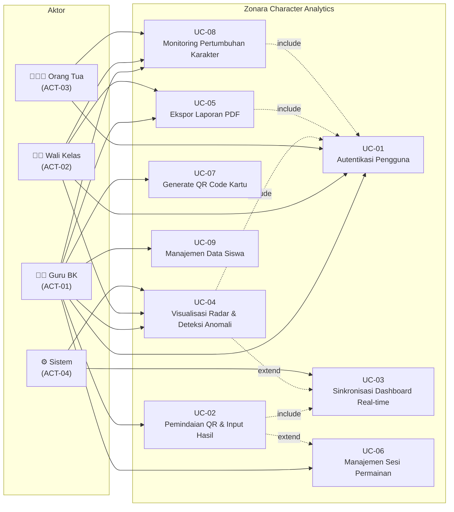

# SPESIFIKASI USE CASE
## Zonara Character Analytics (Enterprise Edition)
### Mengacu pada Standar UML 2.5

| Atribut | Keterangan |
|---------|-----------|
| **Nomor Dokumen** | ZCA-UC-2026-001 |
| **Versi** | 1.0 |
| **Tanggal** | 24 Maret 2026 |
| **Klien** | Azhar M |
| **Dokumen Acuan** | ZCA-SRS-2026-001 (SRS IEEE 830 v1.0) |
| **Status** | Draft — Menunggu Persetujuan |

---

## Riwayat Revisi

| Versi | Tanggal | Penulis | Deskripsi Perubahan |
|-------|---------|---------|---------------------|
| 1.0 | 24/03/2026 | Azhar M | Draft awal berdasarkan SRS IEEE 830 v1.0 |

---

## Daftar Isi

1. [Daftar Aktor](#1-daftar-aktor)
2. [Use Case Diagram](#2-use-case-diagram)
3. [Spesifikasi Use Case Detail](#3-spesifikasi-use-case-detail)
4. [Traceability Matrix](#4-traceability-matrix)

---

## 1. Daftar Aktor

Identifikasi aktor mengacu pada analisis pemangku kepentingan dalam Project Charter (Bab 5.0) dan karakteristik pengguna dalam SRS (Bab 2.3).

| Kode | Aktor | Tipe | Deskripsi | Tingkat Teknis |
|------|-------|------|-----------|:--------------:|
| **ACT-01** | **Guru BK** (Fasilitator Utama) | Primer | Aktor utama yang mengoperasikan sistem secara langsung. Bertanggung jawab atas pembuatan sesi permainan, pemindaian QR kartu, pemberian penilaian (Berhasil/Gagal), serta analisis hasil diagnostik karakter siswa. Memiliki akses penuh (*full access*) terhadap seluruh fitur sistem. | Dasar–Menengah |
| **ACT-02** | **Wali Kelas** (Viewer) | Primer | Aktor yang memantau perkembangan karakter siswa dalam kelas yang diampu. Mengakses dashboard analitik dengan cakupan terbatas pada kelas sendiri (*class-scoped*). Tidak memiliki hak untuk membuat sesi atau menginput skor. | Dasar |
| **ACT-03** | **Orang Tua** (Viewer) | Primer | Aktor yang mengakses ringkasan karakter anak melalui portal khusus. Cakupan akses terbatas pada data anak yang terhubung dengan akunnya (*child-scoped, read-only*). Menerima informasi dengan *positive framing* tanpa perbandingan antar-siswa. | Dasar |
| **ACT-04** | **Sistem** (Admin Backend) | Sekunder | Aktor non-manusia yang merepresentasikan komponen backend otomatis. Bertanggung jawab atas proses: validasi JWT, *broadcast* WebSocket, kalkulasi skor agregat, deteksi anomali (*flag intervensi*), *generate* narasi insight otomatis, dan *generate* QR code/PDF. | — |

### Hierarki Akses (RBAC)

```
Admin/Guru BK (ACT-01)
├── Full CRUD: Sesi, Siswa, Skor
├── Scan QR, Penilaian
├── Dashboard semua kelas (school-scoped)
├── Generate QR, Export PDF
└── Flag Intervensi & Narrative Insight

Wali Kelas (ACT-02)
├── READ: Dashboard kelas sendiri (class-scoped)
├── READ: Growth Tracker siswa kelas sendiri
└── Export PDF kelas sendiri

Orang Tua (ACT-03)
├── READ: Ringkasan karakter anak (child-scoped)
├── READ: Sertifikat karakter
└── Tanpa perbandingan antar-siswa
```

---

## 2. Use Case Diagram

### 2.1 Diagram (Mermaid)



### 2.2 Deskripsi Relasi Tekstual

| No. | Relasi | Tipe | Penjelasan Logika |
|-----|--------|:----:|-------------------|
| 1 | Guru BK → [UC-01 Autentikasi] | Asosiasi | Guru BK harus login untuk mengakses seluruh fitur sistem |
| 2 | Guru BK → [UC-02 Pemindaian QR & Input Hasil] | Asosiasi | Guru BK memindai QR kartu fisik dan menilai siswa selama sesi |
| 3 | Guru BK → [UC-06 Manajemen Sesi] | Asosiasi | Guru BK membuat, mengelola, dan mengakhiri sesi permainan |
| 4 | Guru BK → [UC-07 Generate QR Code] | Asosiasi | Guru BK membuat dan mencetak QR code untuk kartu permainan |
| 5 | Guru BK → [UC-09 Manajemen Siswa] | Asosiasi | Guru BK mengelola data siswa (CRUD) |
| 6 | Wali Kelas → [UC-04 Visualisasi Radar] | Asosiasi | Wali Kelas melihat dashboard karakter kelas sendiri |
| 7 | Wali Kelas → [UC-08 Monitoring Pertumbuhan] | Asosiasi | Wali Kelas memantau *time-series* perkembangan kelas |
| 8 | Orang Tua → [UC-08 Monitoring Pertumbuhan] | Asosiasi | Orang Tua melihat ringkasan karakter anak (child-scoped) |
| 9 | [UC-02] --<<include\>\>--> [UC-03] | Include | Setiap pemindaian QR yang menghasilkan skor **wajib** memicu sinkronisasi dashboard melalui WebSocket |
| 10 | [UC-04] --<<include\>\>--> [UC-01] | Include | Akses ke visualisasi Radar Chart **wajib** melewati autentikasi JWT terlebih dahulu |
| 11 | [UC-02] --<<extend\>\>--> [UC-06] | Extend | Pemindaian QR **dapat** dipicu dari dalam konteks sesi permainan yang aktif |
| 12 | [UC-04] --<<extend\>\>--> [UC-03] | Extend | Visualisasi Radar Chart **dapat** diperbarui secara real-time jika koneksi WebSocket aktif |
| 13 | Sistem → [UC-03 Sinkronisasi] | Asosiasi | Sistem secara otomatis mem-*broadcast* data skor terbaru ke seluruh klien |
| 14 | Sistem → [UC-04 Deteksi Anomali] | Asosiasi | Sistem secara otomatis menghitung flag intervensi pada setiap pembaruan skor |

---

## 3. Spesifikasi Use Case Detail

---

### UC-01: Autentikasi Pengguna (Integrasi JWT)

| Atribut | Detail |
|---------|--------|
| **ID** | UC-01 |
| **Nama** | Autentikasi Pengguna |
| **Aktor Primer** | Guru BK (ACT-01), Wali Kelas (ACT-02), Orang Tua (ACT-03) |
| **Aktor Sekunder** | Sistem (ACT-04) |
| **Deskripsi** | Use case ini mendeskripsikan proses autentikasi pengguna ke dalam sistem menggunakan mekanisme JWT (*JSON Web Token*) dengan dukungan RBAC (*Role-Based Access Control*) yang membedakan tampilan dan hak akses berdasarkan peran |
| **Pemicu (*Trigger*)** | Pengguna mengakses URL aplikasi atau *access token* kedaluwarsa |
| **Frekuensi** | Setiap sesi penggunaan (minimal 1× per hari per pengguna) |
| **FR Terkait** | FR-001.1, FR-001.2, FR-001.3, FR-001.4, FR-001.5, FR-001.6 |

#### Prasyarat (*Preconditions*)

| No. | Kondisi |
|-----|---------|
| PRE-01 | Sistem backend (FastAPI) dan database PostgreSQL dalam keadaan berjalan |
| PRE-02 | Pengguna memiliki akun terdaftar (untuk login) atau belum memiliki akun (untuk registrasi) |
| PRE-03 | Browser pengguna mendukung JavaScript modern (ES6+) |

#### Kondisi Akhir (*Postconditions*)

| No. | Kondisi | Tipe |
|-----|---------|------|
| POST-01 | *Access token* JWT tersimpan di *memory* frontend (Redux store) | Sukses |
| POST-02 | *Refresh token* tersimpan secara aman di *secure storage* | Sukses |
| POST-03 | UI menampilkan navigasi dan konten sesuai role pengguna | Sukses |
| POST-04 | Sistem mencatat *timestamp* login terakhir | Sukses |

#### Alur Dasar (*Basic Flow*)

| Langkah | Aktor | Aksi Sistem |
|:-------:|-------|-------------|
| 1 | Pengguna membuka URL aplikasi (`/`) | Sistem memeriksa keberadaan *access token* di Redux store |
| 2 | — | Sistem mendeteksi tidak ada token valid → mengarahkan ke halaman `/login` |
| 3 | Pengguna memasukkan *username* dan *password* pada formulir login | Sistem memvalidasi format input (username tidak kosong, password ≥ 8 karakter) |
| 4 | Pengguna menekan tombol **"Masuk"** | Sistem mengirim `POST /api/v1/auth/login` dengan *payload* `{username, password}` |
| 5 | — | Backend memverifikasi *username* di tabel `users` dan mencocokkan *password* dengan hash bcrypt |
| 6 | — | Backend menghasilkan *access token* (exp: 30 menit) dan *refresh token* (exp: 7 hari) berisi `{user_id, role, school_id}` |
| 7 | — | Frontend menyimpan token di Redux store (`authSlice`) dan mengekstrak data pengguna |
| 8 | — | Sistem mengevaluasi `role` dari token dan merender navigasi serta halaman sesuai RBAC: Guru BK → Dashboard penuh; Wali Kelas → Dashboard kelas; Orang Tua → Portal anak |
| 9 | Pengguna melihat halaman utama sesuai perannya | — |

#### Alur Alternatif (*Alternative Flow*)

**AF-01: Registrasi Pengguna Baru**

| Langkah | Aktor | Aksi Sistem |
|:-------:|-------|-------------|
| 3a | Pengguna menekan tautan **"Daftar Akun Baru"** | Sistem menampilkan formulir registrasi |
| 3b | Pengguna mengisi: username, password, nama lengkap, role (Guru BK / Orang Tua), sekolah, dan kelas (jika Wali Kelas) atau NIS anak (jika Orang Tua) | Sistem memvalidasi: username unik, password ≥ 8 karakter, sekolah valid |
| 3c | Pengguna menekan tombol **"Daftar"** | Sistem mengirim `POST /api/v1/auth/register` → backend meng-*hash* password dengan bcrypt (salt round ≥ 12) → menyimpan ke tabel `users` |
| 3d | — | Sistem menampilkan pesan sukses dan mengarahkan ke halaman login |
| | | *Kembali ke langkah 3 alur dasar* |

**AF-02: Refresh Token Otomatis**

| Langkah | Aktor | Aksi Sistem |
|:-------:|-------|-------------|
| 1a | — | Sistem mendeteksi *access token* kedaluwarsa saat pengguna sedang menggunakan aplikasi |
| 1b | — | RTK Query *base query* secara otomatis mengirim `POST /api/v1/auth/refresh` dengan *refresh token* |
| 1c | — | Backend memvalidasi *refresh token* → menghasilkan *access token* baru |
| 1d | — | Frontend memperbarui token di Redux store tanpa interupsi pengguna |
| | | *Kembali ke aktivitas yang sedang dilakukan pengguna* |

#### Alur Eksepsi (*Exception Flow*)

| Kode | Kondisi Eksepsi | Respons Sistem |
|------|-----------------|----------------|
| EX-01 | Username atau password salah | Sistem menampilkan pesan: *"Username atau password tidak valid"* tanpa mengungkapkan field mana yang salah (prinsip keamanan). Pengguna tetap di halaman login. |
| EX-02 | Username sudah terdaftar (saat registrasi) | Sistem menampilkan pesan: *"Username sudah digunakan, silakan pilih yang lain"* |
| EX-03 | *Refresh token* kedaluwarsa | Sistem menghapus seluruh token dari Redux store → mengarahkan pengguna ke `/login` dengan pesan: *"Sesi Anda telah berakhir, silakan login kembali"* |
| EX-04 | Koneksi ke backend gagal | Sistem menampilkan indikator *offline* dengan pesan: *"Tidak dapat terhubung ke server"* dan tombol *"Coba Lagi"* |

#### Aturan Bisnis (*Business Rules*)

| Kode | Aturan |
|------|--------|
| BR-01 | Satu username hanya dapat terdaftar untuk satu akun |
| BR-02 | Password minimal 8 karakter, di-hash dengan bcrypt (salt round ≥ 12) |
| BR-03 | Orang Tua wajib menghubungkan akunnya dengan `student_id` anak yang bersangkutan |
| BR-04 | Setiap endpoint API (kecuali `/login` dan `/register`) memerlukan header `Authorization: Bearer <access_token>` |

---

### UC-02: Pemindaian QR Kartu & Input Hasil (Proses Phygital)

| Atribut | Detail |
|---------|--------|
| **ID** | UC-02 |
| **Nama** | Pemindaian QR Kartu & Input Hasil |
| **Aktor Primer** | Guru BK (ACT-01) |
| **Aktor Sekunder** | Sistem (ACT-04) |
| **Deskripsi** | Use case ini mendeskripsikan proses inti interaksi phygital: saat siswa mendarat di petak kartu pada board game fisik, Guru BK memindai QR code pada kartu menggunakan kamera perangkat, sistem menampilkan misi kartu, dan guru menilai performa siswa |
| **Pemicu** | Siswa mendarat di petak kartu tantangan pada board game fisik |
| **Frekuensi** | 4–8× per siswa per sesi permainan |
| **Relasi** | <<include\>\> UC-03 (Sinkronisasi Dashboard); <<extend\>\> UC-06 (Manajemen Sesi) |
| **FR Terkait** | FR-003.1, FR-003.2, FR-003.3, FR-003.4, FR-003.5 |

#### Prasyarat (*Preconditions*)

| No. | Kondisi |
|-----|---------|
| PRE-01 | Guru BK telah terautentikasi (UC-01 berhasil) |
| PRE-02 | Sesi permainan dalam status `active` (UC-06 telah dijalankan) |
| PRE-03 | Siswa telah terdaftar sebagai pemain dalam sesi aktif |
| PRE-04 | Perangkat guru memiliki kamera fungsional dan browser mendukung `getUserMedia` API |
| PRE-05 | Kartu fisik telah ditempeli QR code yang valid (dihasilkan oleh UC-07) |

#### Kondisi Akhir (*Postconditions*)

| No. | Kondisi | Tipe |
|-----|---------|------|
| POST-01 | Skor (result: 0 atau 1) tercatat di tabel `scores` dengan referensi `session_id`, `student_id`, `card_id`, dan `zone_id` | Sukses |
| POST-02 | WebSocket broadcast terpicu → dashboard terperbarui (UC-03) | Sukses |
| POST-03 | Radar Chart mencerminkan skor terbaru | Sukses |

#### Alur Dasar (*Basic Flow*)

| Langkah | Aktor | Aksi Sistem |
|:-------:|-------|-------------|
| 1 | Guru BK membuka halaman **Game Session** dan memilih sesi aktif | Sistem menampilkan daftar pemain (siswa) dalam sesi beserta status giliran |
| 2 | Guru BK memilih siswa yang gilirannya aktif | Sistem menyoroti (*highlight*) pemain terpilih |
| 3 | Guru BK menekan tombol **"Scan Kartu"** | Sistem mengaktifkan modul QR scanner (html5-qrcode) → meminta izin akses kamera melalui `getUserMedia()` |
| 4 | Guru BK mengarahkan kamera ke QR code pada kartu fisik | Sistem melakukan *decode* QR code di sisi frontend secara real-time |
| 5 | — | Sistem mengekstrak `qr_code` string dari hasil decode → mengirim `GET /api/v1/cards?qr={qr_code}` ke backend |
| 6 | — | Backend melakukan *lookup* di tabel `cards` berdasarkan `qr_code` → mengembalikan data kartu: `{id, title, description, zone}` |
| 7 | — | Frontend menampilkan **Card Popup** berisi: judul misi, deskripsi misi, dan badge warna zona (Biru/Hijau/Kuning/Merah) |
| 8 | Guru BK mengobservasi performa siswa dalam menjalankan misi kartu | — |
| 9 | Guru BK menekan tombol **"✅ Berhasil"** atau **"❌ Gagal"** | Sistem mengirim `POST /api/v1/scores` dengan payload `{session_id, student_id, card_id, zone_id, result: 1 atau 0}` |
| 10 | — | Backend menyimpan skor ke tabel `scores` → memicu WebSocket broadcast (UC-03) |
| 11 | — | Sistem menutup Card Popup dan menampilkan notifikasi singkat: *"Skor tercatat ✓"* dengan animasi konfirmasi |
| 12 | — | Dashboard Radar Chart (jika terbuka di tab/perangkat lain) beranimasi memperbarui data |

#### Alur Alternatif (*Alternative Flow*)

**AF-01: Fallback Input Manual**

| Langkah | Aktor | Aksi Sistem |
|:-------:|-------|-------------|
| 4a | Guru BK menekan tautan **"Input Manual"** karena kamera tidak tersedia atau QR tidak terbaca | Sistem menampilkan *text field* untuk memasukkan ID kartu secara manual |
| 4b | Guru BK mengetikkan ID kartu (tercetak di bawah QR pada kartu fisik) | Sistem memvalidasi format ID |
| 4c | Guru BK menekan tombol **"Cari Kartu"** | Sistem melakukan lookup identik dengan langkah 5–6 alur dasar |
| | | *Kembali ke langkah 7 alur dasar* |

**AF-02: Scan Kartu Berulang (Kartu Sama)**

| Langkah | Aktor | Aksi Sistem |
|:-------:|-------|-------------|
| 6a | — | Backend mendeteksi bahwa kombinasi `session_id + student_id + card_id` sudah ada di tabel `scores` |
| 6b | — | Sistem menampilkan peringatan: *"Kartu ini sudah pernah dinilai untuk siswa ini dalam sesi ini. Lanjutkan untuk memperbarui skor?"* |
| 6c | Guru BK memilih **"Ya, Perbarui"** atau **"Batal"** | Jika "Ya" → sistem melakukan UPDATE skor; jika "Batal" → kembali ke langkah 3 |

#### Alur Eksepsi (*Exception Flow*)

| Kode | Kondisi Eksepsi | Respons Sistem |
|------|-----------------|----------------|
| EX-01 | Browser tidak mendukung `getUserMedia` atau izin kamera ditolak | Sistem menampilkan pesan: *"Akses kamera tidak tersedia."* dan secara otomatis menampilkan mode *Input Manual* (AF-01) |
| EX-02 | QR code tidak dikenali (bukan format Zonara) | Sistem menampilkan pesan: *"QR code tidak dikenali. Pastikan Anda memindai kartu Zonara yang valid."* Scanner tetap aktif untuk percobaan ulang. |
| EX-03 | Koneksi ke backend gagal saat mengirim skor | Sistem menyimpan skor ke *local queue* (Redux state) dan menampilkan pesan: *"Skor tersimpan lokal, akan disinkronkan saat koneksi pulih"* dengan indikator *pending* |

#### Aturan Bisnis (*Business Rules*)

| Kode | Aturan |
|------|--------|
| BR-05 | Hanya Guru BK dengan sesi `active` yang dapat melakukan pemindaian dan penilaian |
| BR-06 | Setiap skor terikat pada kombinasi unik `session_id + student_id + card_id` |
| BR-07 | Nilai `result` hanya menerima integer `0` (Gagal) atau `1` (Berhasil) |
| BR-08 | Timestamp penilaian dicatat otomatis oleh backend (`scored_at`) |

---

### UC-03: Sinkronisasi Dashboard Real-time (Mekanisme WebSocket)

| Atribut | Detail |
|---------|--------|
| **ID** | UC-03 |
| **Nama** | Sinkronisasi Dashboard Real-time |
| **Aktor Primer** | Sistem (ACT-04) |
| **Aktor Sekunder** | Guru BK (ACT-01) — sebagai penerima |
| **Deskripsi** | Use case ini mendeskripsikan mekanisme di mana backend secara otomatis mem-*broadcast* pembaruan data skor ke seluruh klien dashboard yang terhubung melalui WebSocket, sehingga Radar Chart di layar proyektor bergerak secara real-time dengan animasi transisi halus |
| **Pemicu** | Skor baru tercatat di database (output dari UC-02 langkah 10) |
| **Frekuensi** | Setiap kali tombol penilaian ditekan (4–8× per siswa per sesi) |
| **FR Terkait** | FR-004.1, FR-004.2, FR-004.3, FR-004.4, FR-004.5 |

#### Prasyarat (*Preconditions*)

| No. | Kondisi |
|-----|---------|
| PRE-01 | Sesi permainan dalam status `active` |
| PRE-02 | Minimal 1 klien dashboard terhubung ke WebSocket endpoint `/ws/dashboard/{session_id}` |
| PRE-03 | Backend WebSocket manager sedang berjalan |

#### Kondisi Akhir (*Postconditions*)

| No. | Kondisi | Tipe |
|-----|---------|------|
| POST-01 | Seluruh klien WebSocket menerima payload data skor terbaru | Sukses |
| POST-02 | Radar Chart di setiap klien menampilkan animasi transisi dari state lama ke state baru | Sukses |
| POST-03 | Flag Intervensi diperbarui jika threshold terlampaui | Sukses |

#### Alur Dasar (*Basic Flow*)

| Langkah | Komponen | Aksi |
|:-------:|----------|------|
| 1 | Backend (Scoring Service) | Menerima dan menyimpan skor baru di tabel `scores` |
| 2 | Backend (Scoring Service) | Menghitung ulang skor agregat per dimensi untuk siswa terkait dalam sesi aktif |
| 3 | Backend (Analytics Service) | Menghitung rata-rata kelas per dimensi dan mengevaluasi threshold flag intervensi (skor < 80% rata-rata kelas) |
| 4 | Backend (WebSocket Service) | Menyusun payload broadcast: `{event: "score_update", student_id, radar_data: [blue, green, yellow, red], class_average: [...], flags: [...], timestamp}` |
| 5 | Backend (WebSocket Service) | Mengirimkan payload ke seluruh koneksi WebSocket yang terdaftar pada `session_id` terkait melalui *fan-out broadcast* |
| 6 | Frontend (WebSocket Middleware) | Redux middleware menerima pesan WebSocket → men-*dispatch* action `scoreUpdated` ke Redux store |
| 7 | Frontend (RadarChart Component) | Recharts mendeteksi perubahan props → Framer Motion merender animasi transisi dari posisi titik lama ke posisi titik baru (durasi ≤ 500ms, easing: `easeInOut`) |
| 8 | Frontend (InterventionFlag Component) | Jika `flags[]` tidak kosong → komponen merender ikon ⚠️ merah pada dimensi yang terdeteksi anomali |

#### Alur Alternatif (*Alternative Flow*)

**AF-01: Tidak Ada Klien Dashboard Terhubung**

| Langkah | Komponen | Aksi |
|:-------:|----------|------|
| 5a | Backend (WebSocket Service) | Mendeteksi `connections[session_id]` kosong → melewatkan broadcast tanpa error |
| — | — | Data tetap tersimpan di database dan akan dimuat saat klien dashboard terhubung berikutnya melalui REST API |

**AF-02: Klien Terhubung Setelah Sesi Berjalan (Late Joiner)**

| Langkah | Komponen | Aksi |
|:-------:|----------|------|
| 0a | Frontend | Klien baru membuka halaman dashboard sesi yang sedang berjalan |
| 0b | Frontend | RTK Query mengirim `GET /api/v1/analytics/radar/class/{class}` untuk memuat data terkini |
| 0c | Frontend (WebSocket Middleware) | Membuka koneksi WebSocket ke `/ws/dashboard/{session_id}` → terdaftar untuk menerima broadcast berikutnya |
| — | — | *Berlanjut ke alur dasar untuk pembaruan berikutnya* |

#### Alur Eksepsi (*Exception Flow*)

| Kode | Kondisi Eksepsi | Respons Sistem |
|------|-----------------|----------------|
| EX-01 | Koneksi WebSocket terputus (jaringan tidak stabil) | Frontend menampilkan indikator *"Koneksi terputus"* (badge merah) → melakukan auto-reconnect dengan *exponential backoff*: 1s → 2s → 4s → 8s → 16s → maks 30s |
| EX-02 | WebSocket reconnect gagal setelah 5 percobaan | Sistem beralih ke mode *REST polling* (interval 5 detik) dan menampilkan pesan: *"Mode real-time tidak tersedia. Data diperbarui secara berkala."* |
| EX-03 | Payload broadcast melebihi ukuran maksimum WebSocket | Backend memecah payload menjadi beberapa pesan terpisah (*chunking*) atau mengirimkan *delta update* (hanya perubahan, bukan data penuh) |

#### Aturan Bisnis (*Business Rules*)

| Kode | Aturan |
|------|--------|
| BR-09 | Broadcast hanya dikirim ke koneksi WebSocket yang terdaftar pada `session_id` relevan |
| BR-10 | Latensi end-to-end dari input skor hingga animasi Radar Chart di klien target ≤ 500ms |
| BR-11 | Sistem mendukung minimal 50 koneksi WebSocket simultan per sesi |

---

### UC-04: Visualisasi Radar Chart & Deteksi Anomali (Diagnostik Karakter)

| Atribut | Detail |
|---------|--------|
| **ID** | UC-04 |
| **Nama** | Visualisasi Radar Chart & Deteksi Anomali |
| **Aktor Primer** | Guru BK (ACT-01), Wali Kelas (ACT-02) |
| **Aktor Sekunder** | Sistem (ACT-04) |
| **Deskripsi** | Use case ini mendeskripsikan proses visualisasi profil karakter siswa dalam format Radar Chart dengan overlay perbandingan terhadap rata-rata kelas, serta mekanisme deteksi anomali otomatis yang memicu flag intervensi bila skor siswa pada dimensi tertentu berada signifikan di bawah rata-rata |
| **Pemicu** | Pengguna membuka halaman Dashboard atau menerima WebSocket update |
| **Frekuensi** | Setiap kali halaman Dashboard diakses atau skor diperbarui |
| **Relasi** | <<include\>\> UC-01 (Autentikasi); <<extend\>\> UC-03 (Sinkronisasi) |
| **FR Terkait** | FR-006.1, FR-006.2, FR-006.3, FR-006.4, FR-006.5 |

#### Prasyarat (*Preconditions*)

| No. | Kondisi |
|-----|---------|
| PRE-01 | Pengguna telah terautentikasi dan memiliki role Guru BK atau Wali Kelas |
| PRE-02 | Minimal 1 sesi permainan telah diselesaikan (`completed`) untuk kelas yang dipilih |
| PRE-03 | Terdapat data skor untuk minimal 1 siswa pada kelas tersebut |

#### Kondisi Akhir (*Postconditions*)

| No. | Kondisi | Tipe |
|-----|---------|------|
| POST-01 | Radar Chart ditampilkan dengan 4 sumbu dimensi CASEL | Sukses |
| POST-02 | Overlay rata-rata kelas (trace transparan abu-abu) ditampilkan di belakang trace individu | Sukses |
| POST-03 | Flag intervensi (ikon ⚠️) ditampilkan pada dimensi yang berada di bawah threshold | Sukses |
| POST-04 | Tabel ringkasan "Area Kekuatan" dan "Area Pertumbuhan" ditampilkan | Sukses |

#### Alur Dasar (*Basic Flow*)

| Langkah | Aktor | Aksi Sistem |
|:-------:|-------|-------------|
| 1 | Pengguna membuka halaman **Dashboard** | Sistem menampilkan filter: dropdown sekolah (jika admin), dropdown kelas |
| 2 | Pengguna memilih kelas dari dropdown | Sistem mengirim `GET /api/v1/analytics/radar/class/{class_name}?school_id={id}` |
| 3 | — | Backend menghitung: (a) skor agregat per dimensi per siswa, (b) rata-rata kelas per dimensi. Query: `SELECT zone_id, student_id, SUM(result) FROM scores WHERE session_id IN (completed sessions for class) GROUP BY zone_id, student_id` |
| 4 | — | Backend mengevaluasi flag intervensi: `flag = TRUE jika skor_siswa[dimensi] < 0.8 × rata_rata_kelas[dimensi]` |
| 5 | — | Backend mengembalikan JSON: `{students: [{id, name, radar: [b,g,y,r], flags: [...]}], class_average: [b,g,y,r]}` |
| 6 | — | Frontend merender Radar Chart (Recharts `RadarChart` component) dengan 4 sumbu: Self-Awareness (Biru), Relationship Skills (Hijau), Responsible Decision Making (Kuning), Social Awareness & Assertiveness (Merah) |
| 7 | Pengguna memilih siswa dari daftar | Sistem menampilkan overlay: trace siswa (warna penuh) di atas trace rata-rata kelas (abu-abu transparan, opacity 0.3) |
| 8 | — | Jika terdapat flag → sistem menampilkan ikon ⚠️ merah pada sumbu dimensi yang ter-flag, beserta tooltip: *"Area Pertumbuhan: skor di bawah rata-rata kelas"* |
| 9 | — | Sistem menampilkan tabel ringkasan: **"Area Kekuatan"** (dimensi dengan skor ≥ rata-rata kelas) dan **"Area Pertumbuhan"** (dimensi dengan skor < rata-rata kelas) menggunakan terminologi *positive framing* |

#### Alur Alternatif (*Alternative Flow*)

**AF-01: Focus Mode (Proyektor)**

| Langkah | Aktor | Aksi Sistem |
|:-------:|-------|-------------|
| 6a | Guru BK menekan tombol **"Focus Mode"** | Sistem beralih ke tampilan *full-screen*: Radar Chart diperbesar, sidebar dan navigasi disembunyikan, font diperbesar untuk keterbacaan dari jarak jauh |
| 6b | — | WebSocket tetap aktif → chart beranimasi real-time saat skor baru masuk |

**AF-02: Tidak Ada Data (Kelas Baru)**

| Langkah | Aktor | Aksi Sistem |
|:-------:|-------|-------------|
| 3a | — | Backend mengembalikan `students: []` (kosong) |
| 3b | — | Frontend menampilkan *empty state* dengan ilustrasi dan pesan: *"Belum ada data sesi untuk kelas ini. Mulai sesi permainan untuk melihat radar chart."* |

#### Alur Eksepsi (*Exception Flow*)

| Kode | Kondisi Eksepsi | Respons Sistem |
|------|-----------------|----------------|
| EX-01 | Wali Kelas mencoba mengakses data kelas lain | Backend mengembalikan HTTP 403 Forbidden. Frontend menampilkan: *"Anda hanya memiliki akses untuk kelas Anda."* |
| EX-02 | Data skor terlalu sedikit untuk kalkulasi rata-rata bermakna (< 3 siswa) | Sistem menampilkan disclaimer: *"Data rata-rata kelas berdasarkan < 3 siswa. Interpretasi dengan hati-hati."* Flag intervensi dinonaktifkan. |

#### Aturan Bisnis (*Business Rules*)

| Kode | Aturan |
|------|--------|
| BR-12 | Threshold flag intervensi = skor siswa < **80%** dari rata-rata kelas pada dimensi bersangkutan |
| BR-13 | Terminologi wajib menggunakan *positive framing*: "Area Kekuatan" dan "Area Pertumbuhan" |
| BR-14 | Wali Kelas hanya dapat melihat data kelas yang diampu (*class-scoped*) |
| BR-15 | Focus Mode menghilangkan elemen navigasi dan memaksimalkan area chart |

---

### UC-05: Ekspor Laporan Pertumbuhan Karakter (Format PDF)

| Atribut | Detail |
|---------|--------|
| **ID** | UC-05 |
| **Nama** | Ekspor Laporan Pertumbuhan Karakter |
| **Aktor Primer** | Guru BK (ACT-01), Wali Kelas (ACT-02) |
| **Aktor Sekunder** | Sistem (ACT-04) |
| **Deskripsi** | Use case ini mendeskripsikan proses pembuatan dan pengunduhan laporan karakter siswa dalam format PDF bergaya akademik formal, mencakup grafik Radar Chart, tabel skor per dimensi, *narrative insight* otomatis, dan rekomendasi tindak lanjut |
| **Pemicu** | Pengguna menekan tombol "Export PDF" pada halaman Reports |
| **Frekuensi** | Bulanan (setelah evaluasi) atau sesuai kebutuhan |
| **Relasi** | <<include\>\> UC-01 (Autentikasi) |
| **FR Terkait** | FR-005.1 (implisit — laporan), FR-006.5 |

#### Prasyarat (*Preconditions*)

| No. | Kondisi |
|-----|---------|
| PRE-01 | Pengguna telah terautentikasi dengan role Guru BK atau Wali Kelas |
| PRE-02 | Terdapat data skor yang cukup untuk siswa/kelas yang dipilih |
| PRE-03 | Backend PDF generation service (FPDF2) berjalan normal |

#### Kondisi Akhir (*Postconditions*)

| No. | Kondisi | Tipe |
|-----|---------|------|
| POST-01 | File PDF ter-*generate* dan siap diunduh di browser | Sukses |
| POST-02 | PDF berisi: header sekolah, data siswa, Radar Chart, tabel skor, *narrative insight*, rekomendasi | Sukses |

#### Alur Dasar (*Basic Flow*)

| Langkah | Aktor | Aksi Sistem |
|:-------:|-------|-------------|
| 1 | Pengguna membuka halaman **Reports** | Sistem menampilkan dua opsi: "Laporan Per Siswa" dan "Ringkasan Kelas" |
| 2 | Pengguna memilih **"Laporan Per Siswa"** | Sistem menampilkan dropdown kelas dan daftar siswa |
| 3 | Pengguna memilih siswa target | Sistem menampilkan *preview* ringkasan data: radar chart mini dan skor per dimensi |
| 4 | Pengguna menekan tombol **"📄 Generate PDF"** | Sistem menampilkan *loading indicator* dan mengirim `GET /api/v1/reports/student/{id}/pdf` |
| 5 | — | Backend mengambil seluruh skor siswa dari tabel `scores` → menghitung agregat per dimensi |
| 6 | — | Backend menghasilkan Radar Chart sebagai gambar (matplotlib/plotly → PNG buffer) |
| 7 | — | Backend menjalankan *Narrative Insight Generator*: membandingkan skor antar-dimensi dan dengan rata-rata kelas, menghasilkan paragraf deskriptif |
| 8 | — | Backend menyusun PDF menggunakan FPDF2 dengan layout: (a) Header: logo Zonara + nama sekolah + tanggal, (b) Data siswa: nama, NIS, kelas, (c) Radar Chart (embedded image), (d) Tabel skor per dimensi, (e) Narrative Insight, (f) Rekomendasi tindak lanjut, (g) Footer: disclaimer + *positive framing* note |
| 9 | — | Backend mengembalikan file PDF sebagai `StreamingResponse` (content-type: `application/pdf`) |
| 10 | Pengguna menerima dialog unduh browser → menyimpan file PDF | — |

#### Alur Alternatif (*Alternative Flow*)

**AF-01: Ekspor Ringkasan Kelas**

| Langkah | Aktor | Aksi Sistem |
|:-------:|-------|-------------|
| 2a | Pengguna memilih **"Ringkasan Kelas"** | Sistem menampilkan dropdown kelas |
| 2b | Pengguna memilih kelas dan menekan **"Generate PDF"** | Backend menghasilkan PDF ringkasan: daftar seluruh siswa, Radar Chart overlay kelas, tabel skor komparatif, daftar siswa dengan flag intervensi |
| | | *Kembali ke langkah 9 alur dasar* |

**AF-02: Ekspor dengan Rentang Waktu**

| Langkah | Aktor | Aksi Sistem |
|:-------:|-------|-------------|
| 3a | Pengguna mengaktifkan filter **"Periode"** dan memilih rentang bulan (misal: Januari–Maret) | Sistem menyertakan line chart *time-series* dalam PDF dan narrative insight yang mencakup tren sepanjang periode |

#### Alur Eksepsi (*Exception Flow*)

| Kode | Kondisi Eksepsi | Respons Sistem |
|------|-----------------|----------------|
| EX-01 | Data skor tidak mencukupi (0 sesi ter-*complete*) | Sistem menampilkan pesan: *"Belum cukup data untuk menghasilkan laporan. Minimal 1 sesi permainan harus diselesaikan."* Tombol "Generate" dinonaktifkan. |
| EX-02 | Proses generate PDF gagal (server error) | Sistem menampilkan pesan: *"Gagal membuat laporan. Silakan coba lagi."* dengan tombol retry. Log error dikirim ke backend. |
| EX-03 | Timeout (>10 detik) pada generate PDF kelas besar (>30 siswa) | Sistem menampilkan *progress bar* estimasi dan memproses secara asynchronous. Pengguna dapat meninggalkan halaman dan dinotifikasi saat selesai. |

#### Aturan Bisnis (*Business Rules*)

| Kode | Aturan |
|------|--------|
| BR-16 | Laporan PDF wajib menggunakan terminologi *positive framing* secara konsisten |
| BR-17 | Laporan orang tua **tidak** menyertakan perbandingan dengan siswa lain (child-scoped) |
| BR-18 | Format PDF mengikuti standar laporan akademik: font serif, margin 2.5cm, header/footer konsisten |
| BR-19 | Radar Chart di PDF dihasilkan sebagai PNG resolusi tinggi (300 DPI) untuk kualitas cetak |

---

## 4. Traceability Matrix

Matriks ketertelusuran berikut menghubungkan setiap **Kebutuhan Fungsional** (FR) yang didefinisikan dalam SRS (ZCA-SRS-2026-001) dengan **Use Case** (UC) yang mengimplementasikannya. Tujuannya adalah menjamin bahwa seluruh kebutuhan tercakup dalam desain use case (*forward traceability*) dan setiap use case memiliki dasar kebutuhan (*backward traceability*).

### 4.1 FR-001: Autentikasi JWT & RBAC → UC-01

| ID Kebutuhan | Deskripsi (Ringkas) | Use Case | Langkah |
|:------------:|---------------------|:--------:|:-------:|
| FR-001.1 | Halaman registrasi (username, password, role, sekolah) | UC-01 | AF-01 (3a–3d) |
| FR-001.2 | JWT access token (30min) + refresh token (7hari) | UC-01 | Basic 5–6, AF-02 |
| FR-001.3 | Hash password bcrypt (salt ≥ 12) | UC-01 | AF-01 (3c) |
| FR-001.4 | RBAC 3 tingkat (Guru BK, Wali Kelas, Orang Tua) | UC-01 | Basic 8 |
| FR-001.5 | UI kondisional berdasarkan role | UC-01 | Basic 8–9 |
| FR-001.6 | Redirect ke login jika token expired | UC-01 | EX-03 |

### 4.2 FR-002: Manajemen Sesi & Siswa → UC-06, UC-09

| ID Kebutuhan | Deskripsi (Ringkas) | Use Case | Langkah |
|:------------:|---------------------|:--------:|:-------:|
| FR-002.1 | Guru BK buat sesi, pilih kelas, tambah siswa | UC-06 | Basic Flow |
| FR-002.2 | Generate kode sesi unik 6 karakter | UC-06 | Basic Flow |
| FR-002.3 | CRUD data siswa (NIS, nama, kelas, sekolah) | UC-09 | Basic Flow |
| FR-002.4 | Multi-tenant `school_id` di setiap tabel | UC-06, UC-09 | Preconditions |
| FR-002.5 | Catat waktu mulai/selesai, status active→completed | UC-06 | Basic Flow |

### 4.3 FR-003: QR Scanner Decoder → UC-02

| ID Kebutuhan | Deskripsi (Ringkas) | Use Case | Langkah |
|:------------:|---------------------|:--------:|:-------:|
| FR-003.1 | Aktifkan kamera via `getUserMedia()` | UC-02 | Basic 3 |
| FR-003.2 | Decode QR frontend (html5-qrcode) → kirim card_id | UC-02 | Basic 4–5 |
| FR-003.3 | Popup: judul misi, deskripsi, badge zona | UC-02 | Basic 7 |
| FR-003.4 | Tombol "Berhasil" (1) dan "Gagal" (0) | UC-02 | Basic 9 |
| FR-003.5 | Fallback input teks manual ID kartu | UC-02 | AF-01 (4a–4c) |

### 4.4 FR-004: WebSocket Live-Sync → UC-03

| ID Kebutuhan | Deskripsi (Ringkas) | Use Case | Langkah |
|:------------:|---------------------|:--------:|:-------:|
| FR-004.1 | WS koneksi per sesi `/ws/dashboard/{session_id}` | UC-03 | Basic 5 |
| FR-004.2 | Broadcast skor terbaru ke semua klien | UC-03 | Basic 4–5 |
| FR-004.3 | Animasi Radar Chart transisi ≤ 500ms (Framer Motion) | UC-03 | Basic 7 |
| FR-004.4 | Indikator status koneksi WS (terhubung/terputus) | UC-03 | EX-01 |
| FR-004.5 | Auto-reconnect exponential backoff (1s→30s) | UC-03 | EX-01 |

### 4.5 FR-005: Admin Card & QR Generator → UC-07

| ID Kebutuhan | Deskripsi (Ringkas) | Use Case | Langkah |
|:------------:|---------------------|:--------:|:-------:|
| FR-005.1 | Halaman Admin QR Generator, daftar kartu + QR | UC-07 | Basic Flow |
| FR-005.2 | Generate QR unik per kartu (qrcode + Pillow) | UC-07 | Basic Flow |
| FR-005.3 | Download QR individual per kartu (PNG) | UC-07 | Basic Flow |
| FR-005.4 | Download seluruh QR dalam satu file ZIP | UC-07 | AF: Batch Export |
| FR-005.5 | Halaman print-ready (grid QR + label zona) | UC-07 | AF: Printable |

### 4.6 FR-006: Anomaly Detection (Flag Intervensi) → UC-04

| ID Kebutuhan | Deskripsi (Ringkas) | Use Case | Langkah |
|:------------:|---------------------|:--------:|:-------:|
| FR-006.1 | Hitung rata-rata skor per dimensi per kelas | UC-04 | Basic 3 |
| FR-006.2 | Flag jika skor siswa < 80% rata-rata kelas | UC-04 | Basic 3 (logika Backend), 8 (tampilan) |
| FR-006.3 | Ikon ⚠️ merah pada dimensi ter-flag | UC-04 | Basic 8 |
| FR-006.4 | Daftar siswa dengan flag di dashboard kelas | UC-04 | Basic 9 |
| FR-006.5 | Terminologi positive framing ("Area Pertumbuhan") | UC-04 | Basic 9, BR-13 |

### 4.7 Matriks Ringkasan (Cross-Reference)

|  | UC-01 | UC-02 | UC-03 | UC-04 | UC-05 | UC-06 | UC-07 | UC-08 | UC-09 |
|--|:-----:|:-----:|:-----:|:-----:|:-----:|:-----:|:-----:|:-----:|:-----:|
| **FR-001** | ✅ | | | | | | | | |
| **FR-002** | | | | | | ✅ | | | ✅ |
| **FR-003** | | ✅ | | | | | | | |
| **FR-004** | | | ✅ | | | | | | |
| **FR-005** | | | | | | | ✅ | | |
| **FR-006** | | | | ✅ | ✅ | | | | |

> ✅ = Use Case mengimplementasikan kebutuhan fungsional terkait secara langsung.

---

## Glosarium Teknis

| Istilah | Definisi |
|---------|----------|
| *Basic Flow* | Alur utama (*sunny day scenario*) yang menggambarkan interaksi normal tanpa gangguan |
| *Alternative Flow* | Alur alternatif yang valid namun berbeda dari alur utama |
| *Exception Flow* | Alur yang dipicu oleh kondisi kesalahan atau kegagalan sistem |
| *Fan-out Broadcast* | Pola distribusi pesan di mana satu pesan dikirim ke seluruh subscriber yang terdaftar |
| *Exponential Backoff* | Strategi *retry* di mana interval antar percobaan meningkat secara eksponensial |
| *Delta Update* | Pengiriman hanya data yang berubah (selisih), bukan keseluruhan dataset |
| *Positive Framing* | Penyajian informasi menggunakan terminologi positif untuk menghindari dampak psikologis negatif |

---

> **Catatan:** Dokumen ini merupakan turunan dari SRS IEEE 830 (ZCA-SRS-2026-001) dan akan diperbarui seiring evolusi kebutuhan sistem.
